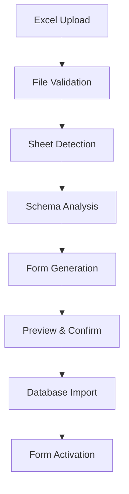

# Wabi Care - Special Education Data Collection Platform Architecture

## Executive Summary

This document outlines the architecture for digitizing the Watson Institute's special education data collection processes, replacing manual Excel/Word document workflows with an integrated digital platform built on the wabi-care-softui application.

## Current State Analysis

### Existing Workflow (IEPWriter.com + Manual Documents)
1. **Student Intake**: Admin completes intake forms (Word docs)
2. **Data Upload**: Forms uploaded to IEPWriter.com
3. **IEP Creation**: BCBAs/Teachers design IEP with goals (Word/Excel docs)
4. **Class Delivery**: Teachers conduct classes
5. **Data Collection**: Teachers update progress in Excel/Word documents
6. **Final Upload**: Data manually uploaded back to IEPWriter.com

### Pain Points
- **Manual Data Entry**: Double/triple data entry across systems
- **Version Control**: Multiple document versions causing confusion
- **Real-time Collaboration**: Limited ability for team collaboration
- **Data Integrity**: Risk of data loss or inconsistencies
- **Reporting**: Difficult to generate comprehensive reports
- **Mobile Access**: Limited mobile-friendly data collection

## Proposed Solution Architecture

### 1. System Overview

```
┌─────────────────┐    ┌──────────────────┐    ┌─────────────────┐
│   Student       │    │   Wabi Care      │    │   External      │
│   Intake        │───▶│   Platform       │◀───│   IEPWriter     │
│   (Digital)     │    │   (Core System)  │    │   (Integration) │
└─────────────────┘    └──────────────────┘    └─────────────────┘
                                │
                                ▼
                       ┌──────────────────┐
                       │   Data Storage   │
                       │   & Analytics    │
                       └──────────────────┘
```

### 2. Core Components

#### 2.1 Student Management System
- **Student Profiles**: Comprehensive student information
- **Intake Forms**: Digital intake process with validation
- **Enrollment Tracking**: Student lifecycle management
- **Family Information**: Parent/guardian contact details

#### 2.2 Assessment & Data Collection Engine
- **Dynamic Form Builder**: Convert Excel sheets to digital forms
- **Assessment Templates**: Pre-built templates for common assessments
- **Real-time Data Entry**: Mobile-friendly data collection
- **Progress Tracking**: Visual progress indicators

#### 2.3 IEP Management System
- **Goal Setting**: Digital goal creation and management
- **Goal Tracking**: Progress monitoring against IEP goals
- **Collaboration Tools**: Multi-user goal development
- **Compliance Reporting**: Automated compliance documentation

#### 2.4 Curriculum Integration
- **L.I.F.E Curriculum**: Digital implementation of Watson curriculum
- **Skill Tracking**: Progress through curriculum domains
- **Adaptive Learning**: Personalized learning paths
- **Resource Library**: Digital teaching materials

### 3. Database Schema Design

#### 3.1 Core Entities

```sql
-- Students
Students {
  id: UUID (Primary Key)
  firstName: VARCHAR(100)
  lastName: VARCHAR(100)
  dateOfBirth: DATE
  enrollmentDate: DATE
  status: ENUM('active', 'inactive', 'graduated')
  schoolId: UUID (Foreign Key)
  createdAt: TIMESTAMP
  updatedAt: TIMESTAMP
}

-- Assessments
Assessments {
  id: UUID (Primary Key)
  studentId: UUID (Foreign Key)
  assessmentType: ENUM('FAST', 'VB-MAPP', 'ABLLS', 'AFLS', 'Custom')
  assessmentName: VARCHAR(200)
  status: ENUM('draft', 'in_progress', 'completed')
  createdBy: UUID (Foreign Key)
  createdAt: TIMESTAMP
  completedAt: TIMESTAMP
}

-- Assessment Data Points
AssessmentDataPoints {
  id: UUID (Primary Key)
  assessmentId: UUID (Foreign Key)
  fieldName: VARCHAR(100)
  fieldValue: TEXT
  dataType: ENUM('text', 'number', 'date', 'boolean', 'rating')
  recordedAt: TIMESTAMP
  recordedBy: UUID (Foreign Key)
}

-- IEP Goals
IEPGoals {
  id: UUID (Primary Key)
  studentId: UUID (Foreign Key)
  goalTitle: VARCHAR(200)
  goalDescription: TEXT
  domain: VARCHAR(100) -- Communication, Academic, Behavioral, etc.
  targetDate: DATE
  status: ENUM('active', 'achieved', 'modified', 'discontinued')
  createdBy: UUID (Foreign Key)
  createdAt: TIMESTAMP
}

-- Goal Progress
GoalProgress {
  id: UUID (Primary Key)
  goalId: UUID (Foreign Key)
  progressValue: DECIMAL(5,2)
  progressNotes: TEXT
  recordedAt: TIMESTAMP
  recordedBy: UUID (Foreign Key)
}

-- Data Collection Forms
DataCollectionForms {
  id: UUID (Primary Key)
  formName: VARCHAR(200)
  formType: ENUM('assessment', 'progress', 'behavior', 'academic')
  formSchema: JSON -- Dynamic form structure
  isActive: BOOLEAN
  createdBy: UUID (Foreign Key)
  createdAt: TIMESTAMP
}
```

#### 3.2 Assessment-Specific Tables

```sql
-- FAST Assessment
FASTData {
  id: UUID (Primary Key)
  assessmentId: UUID (Foreign Key)
  attentionScore: DECIMAL(5,2)
  tangibleScore: DECIMAL(5,2)
  escapeScore: DECIMAL(5,2)
  sensoryScore: DECIMAL(5,2)
  painAttenuationScore: DECIMAL(5,2)
  totalScore: DECIMAL(5,2)
  recordedAt: TIMESTAMP
}

-- VB-MAPP Milestones
VB_MAPP_Milestones {
  id: UUID (Primary Key)
  assessmentId: UUID (Foreign Key)
  milestone: VARCHAR(100)
  level: INTEGER
  score: INTEGER
  notes: TEXT
  recordedAt: TIMESTAMP
}

-- ABLLS Skills
ABLLS_Skills {
  id: UUID (Primary Key)
  assessmentId: UUID (Foreign Key)
  skillArea: VARCHAR(100)
  skillNumber: VARCHAR(20)
  score: INTEGER
  notes: TEXT
  recordedAt: TIMESTAMP
}
```

### 4. User Interface Design

#### 4.1 Dashboard Layout
```
┌─────────────────────────────────────────────────────────────┐
│  Header: Logo | User Profile | Notifications | Settings    │
├─────────────────────────────────────────────────────────────┤
│  Sidebar Navigation                                        │
│  ├─ Students                                               │
│  ├─ Assessments                                           │
│  ├─ IEP Goals                                             │
│  ├─ Data Collection                                       │
│  ├─ Reports                                               │
│  └─ Admin                                                 │
├─────────────────────────────────────────────────────────────┤
│  Main Content Area                                         │
│  ┌─────────────────┐ ┌─────────────────┐ ┌───────────────┐ │
│  │  Quick Stats    │ │  Recent Activity│ │  Alerts       │ │
│  └─────────────────┘ └─────────────────┘ └───────────────┘ │
│  ┌─────────────────────────────────────────────────────────┐ │
│  │  Student List / Assessment Forms / Goal Tracking       │ │
│  └─────────────────────────────────────────────────────────┘ │
└─────────────────────────────────────────────────────────────┘
```

#### 4.2 Key UI Components

**Student Management**
- Student cards with key information
- Search and filter capabilities
- Quick action buttons (New Assessment, View IEP, etc.)

**Assessment Forms**
- Dynamic form rendering based on Excel templates
- Progress indicators
- Save draft functionality
- Validation feedback

**IEP Goal Management**
- Goal creation wizard
- Progress tracking charts
- Collaboration comments
- Goal modification history

**Data Collection**
- Mobile-optimized forms
- Offline capability
- Photo/video attachments
- Quick data entry shortcuts

### 5. Excel Integration System

#### 5.1 Excel Upload & Processing Pipeline



#### 5.2 Excel Processing Features
- **Auto-detection**: Identify assessment types from Excel structure
- **Field Mapping**: Map Excel columns to database fields
- **Validation Rules**: Apply data validation based on assessment type
- **Template Library**: Store common Excel templates for reuse
- **Version Control**: Track changes to uploaded forms

### 6. API Design

#### 6.1 Core Endpoints

```typescript
// Student Management
GET    /api/students                    // List students
POST   /api/students                    // Create student
GET    /api/students/:id                // Get student details
PUT    /api/students/:id                // Update student
DELETE /api/students/:id                // Delete student

// Assessment Management
GET    /api/assessments                 // List assessments
POST   /api/assessments                 // Create assessment
GET    /api/assessments/:id             // Get assessment details
PUT    /api/assessments/:id             // Update assessment
POST   /api/assessments/:id/data        // Add assessment data

// IEP Goals
GET    /api/students/:id/goals          // Get student goals
POST   /api/students/:id/goals          // Create goal
PUT    /api/goals/:id                   // Update goal
POST   /api/goals/:id/progress          // Record progress

// Data Collection
GET    /api/forms                       // List available forms
POST   /api/forms                       // Create form from Excel
GET    /api/forms/:id                   // Get form schema
POST   /api/forms/:id/submit            // Submit form data

// Excel Processing
POST   /api/excel/upload                // Upload Excel file
POST   /api/excel/process               // Process Excel to form
GET    /api/excel/templates             // List available templates
```

### 7. Integration with IEPWriter.com

#### 7.1 Data Synchronization
- **Bidirectional Sync**: Keep data synchronized between systems
- **Conflict Resolution**: Handle data conflicts gracefully
- **Audit Trail**: Track all data changes and syncs
- **Error Handling**: Robust error handling and retry mechanisms

#### 7.2 Export/Import Capabilities
- **IEP Export**: Export completed IEPs to IEPWriter format
- **Assessment Import**: Import existing assessment data
- **Bulk Operations**: Support for bulk data operations
- **Format Conversion**: Convert between different data formats

### 8. Security & Compliance

#### 8.1 Data Protection
- **Encryption**: End-to-end encryption for sensitive data
- **Access Control**: Role-based access control (RBAC)
- **Audit Logging**: Comprehensive audit trails
- **Data Retention**: Configurable data retention policies

#### 8.2 Compliance Requirements
- **FERPA Compliance**: Family Educational Rights and Privacy Act
- **HIPAA Compliance**: Health Insurance Portability and Accountability Act
- **State Regulations**: Compliance with state special education regulations
- **Data Backup**: Regular automated backups

### 9. Mobile Application

#### 9.1 Mobile-First Features
- **Offline Data Collection**: Work without internet connection
- **Photo/Video Capture**: Attach media to assessments
- **Voice Notes**: Record voice observations
- **Quick Entry**: Streamlined data entry interfaces
- **Push Notifications**: Real-time updates and reminders

#### 9.2 Progressive Web App (PWA)
- **Installable**: Can be installed on mobile devices
- **Offline Capability**: Works offline with sync when online
- **Native-like Experience**: App-like interface and performance
- **Cross-platform**: Works on iOS, Android, and desktop

### 10. Reporting & Analytics

#### 10.1 Standard Reports
- **Student Progress Reports**: Individual student progress tracking
- **Assessment Summaries**: Aggregate assessment data
- **Goal Achievement Reports**: IEP goal completion rates
- **Compliance Reports**: Regulatory compliance documentation

#### 10.2 Advanced Analytics
- **Trend Analysis**: Identify patterns in student progress
- **Predictive Analytics**: Predict student outcomes
- **Performance Dashboards**: Real-time performance metrics
- **Custom Reports**: User-defined report generation

### 11. Implementation Phases

#### Phase 1: Foundation (Months 1-2)
- [ ] Database schema implementation
- [ ] Basic student management
- [ ] User authentication and authorization
- [ ] Excel upload and processing system

#### Phase 2: Core Features (Months 3-4)
- [ ] Assessment form generation
- [ ] Data collection interfaces
- [ ] Basic reporting
- [ ] Mobile-responsive design

#### Phase 3: Advanced Features (Months 5-6)
- [ ] IEP goal management
- [ ] Advanced analytics
- [ ] IEPWriter integration
- [ ] Mobile app development

#### Phase 4: Optimization (Months 7-8)
- [ ] Performance optimization
- [ ] Advanced reporting
- [ ] User training materials
- [ ] Production deployment

### 12. Technology Stack

#### 12.1 Frontend
- **Framework**: Next.js with TypeScript
- **UI Library**: SoftUI components
- **State Management**: Redux Toolkit
- **Charts**: Chart.js or D3.js
- **Forms**: React Hook Form with validation

#### 12.2 Backend
- **Runtime**: Node.js with TypeScript
- **Framework**: Express.js or Fastify
- **Database**: PostgreSQL with Prisma ORM
- **File Storage**: AWS S3 or similar
- **Authentication**: JWT with refresh tokens

#### 12.3 Infrastructure
- **Hosting**: Vercel or AWS
- **Database**: PostgreSQL (managed service)
- **CDN**: CloudFront or similar
- **Monitoring**: Sentry for error tracking
- **Analytics**: Google Analytics or Mixpanel

### 13. Success Metrics

#### 13.1 User Adoption
- **Active Users**: Daily/monthly active users
- **Feature Usage**: Most used features and workflows
- **User Satisfaction**: Regular user feedback surveys
- **Training Completion**: User training completion rates

#### 13.2 Operational Efficiency
- **Data Entry Time**: Reduction in manual data entry time
- **Error Rates**: Decrease in data entry errors
- **Report Generation**: Time to generate reports
- **System Uptime**: Platform availability metrics

#### 13.3 Student Outcomes
- **Goal Achievement**: IEP goal completion rates
- **Progress Tracking**: Improved progress monitoring
- **Assessment Completion**: Assessment completion rates
- **Data Quality**: Improved data accuracy and completeness

## Next Steps

1. **Stakeholder Review**: Present architecture to Watson Institute team
2. **Technical Validation**: Validate technical feasibility and requirements
3. **Prototype Development**: Build MVP prototype for key features
4. **User Testing**: Conduct user testing with teachers and administrators
5. **Iterative Development**: Refine based on feedback and requirements
6. **Production Deployment**: Deploy to production environment
7. **Training & Support**: Provide comprehensive training and ongoing support

---

*This architecture document serves as a living document and will be updated as requirements evolve and the project progresses.*
