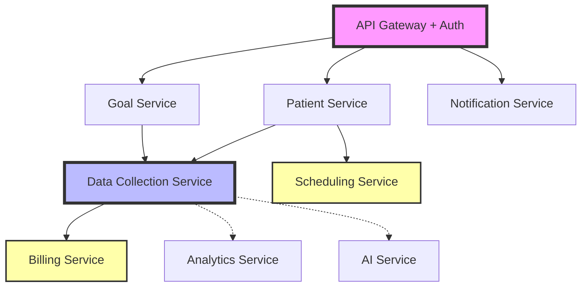

# Wabi Care: AI-First ABA Practice Management Architecture

---

## ⚠️ **DEPRECATION NOTICE**

**This document is deprecated as of October 16, 2025.**

This file (1767 lines) has been split into focused documents following product development best practices:

- **Product aspects** → [PRD.md](./PRD.md) - Product Requirements Document
- **Functional aspects** → [FUNCTIONAL_SPEC.md](./FUNCTIONAL_SPEC.md) - Functional Specification
- **Technical aspects** → [TECHNICAL_SPEC.md](./TECHNICAL_SPEC.md) - Technical Specification
- **Microsoft 365 integration** → [M365_INTEGRATION.md](./M365_INTEGRATION.md) - Integration Guide
- **Visual diagrams** → [design_mermaid.md](./design_mermaid.md) - Architecture Diagrams

**Please use the new documents above instead of this file.**

See [README.md](./README.md) for a complete documentation index and navigation guide.

This file will be archived in the future. Content below is kept for reference only.

---

## Executive Summary

Wabi Care is positioned to disrupt the ABA practice management market through an AI-first, Azure-native platform that addresses critical gaps in existing solutions. This document outlines our competitive strategy, core features, and technical architecture designed to establish Wabi Care as the leading intelligent ABA practice management solution.

---

## Competitive Landscape Analysis

### Current Market Leaders

#### 1. **CentralReach**
- **Strengths**: Comprehensive all-in-one platform, mature billing/RCM, strong market presence
- **Weaknesses**: Complex UI with steep learning curve, lacks modern AI capabilities, expensive for small practices
- **Market Position**: Enterprise-focused, high-touch implementation

#### 2. **Motivity**
- **Strengths**: AI-trained scheduling, real-time data collection, credential tracking
- **Weaknesses**: Limited AI beyond scheduling, moderate reporting capabilities
- **Market Position**: Mid-market focus, strong scheduling features

#### 3. **SpectrumAI**
- **Strengths**: Modern interface, cloud-based infrastructure
- **Weaknesses**: Limited market penetration, fewer integrations
- **Market Position**: Emerging player, targeting smaller practices

#### 4. **Ai-Measures**
- **Strengths**: Specialized assessment tools, strong data collection for research
- **Weaknesses**: Not a full practice management solution, limited administrative features
- **Market Position**: Niche player focused on assessment and data collection

#### 5. **3Y Health**
- **Strengths**: Telehealth integration, flexible therapy management
- **Weaknesses**: Limited AI capabilities, basic reporting
- **Market Position**: Small to mid-market, telehealth-forward approach

### Market Gaps & Opportunities

1. **AI-Driven Clinical Insights**: No competitor offers real-time, AI-powered treatment recommendations
2. **Predictive Analytics**: Limited forecasting for patient outcomes, staffing needs, or revenue
3. **Conversational AI Assistant**: No integrated AI assistant for clinicians
4. **Modern UX/UI**: Most solutions have outdated, cluttered interfaces
5. **Proactive Automation**: Current solutions react; they don't predict and prevent
6. **Azure Ecosystem**: No major competitor leverages Azure's healthcare-optimized AI services

---

## Top 6 Differentiating Features (AI-First Approach)

### 1. **AI Clinical Co-Pilot**
**Problem Solved**: Clinicians spend 40% of time on documentation and administrative tasks

**Solution**:
- **Real-time session transcription** using Azure Cognitive Services Speech-to-Text
- **Automatic progress note generation** powered by Azure OpenAI GPT-4
- **Treatment recommendation engine** analyzing patient data patterns
- **Voice-activated data collection** during therapy sessions
- **Intelligent IEP goal suggestions** based on historical outcomes

**Competitive Advantage**: First ABA platform with an embedded AI assistant that acts as a clinical co-pilot, reducing documentation time by 60%

**Azure Stack**:
- Azure OpenAI Service (GPT-4, Embeddings)
- Azure Cognitive Services (Speech, Language Understanding)
- Azure AI Document Intelligence

---

### 2. **Predictive Practice Analytics**
**Problem Solved**: Practice owners lack foresight into staffing, revenue, and patient outcomes

**Solution**:
- **Patient outcome prediction** using ML models trained on historical data
- **Revenue forecasting** with 90%+ accuracy based on treatment patterns
- **Staffing optimization** predicting workload and recommending hires
- **Risk identification** for patient dropout or treatment plateaus
- **Proactive compliance alerts** before issues arise

**Competitive Advantage**: Only platform that predicts future practice performance, not just reports past data

**Azure Stack**:
- Azure Machine Learning
- Azure Synapse Analytics
- Azure Data Factory
- Power BI Embedded

---

### 3. **Intelligent Scheduling & Resource Optimization**
**Problem Solved**: Manual scheduling wastes 10+ hours/week and causes conflicts

**Solution**:
- **AI-powered auto-scheduling** considering therapist skills, patient needs, location, insurance
- **Dynamic rescheduling** when cancellations occur
- **Travel time optimization** for mobile therapists
- **Patient-therapist matching** based on treatment success patterns
- **Predictive no-show prevention** with automated reminders

**Competitive Advantage**: Goes beyond basic AI scheduling (like Motivity) to consider 20+ variables and learn from outcomes

**Azure Stack**:
- Azure Cognitive Services (Personalization)
- Azure Functions (serverless scheduling logic)
- Azure Logic Apps (workflow automation)

---

### 4. **Automated Billing & RCM with AI Denial Prevention**
**Problem Solved**: Insurance denials cost practices 15-20% of potential revenue

**Solution**:
- **Pre-submission claim scrubbing** using AI to detect errors
- **Denial prediction** with 85%+ accuracy before submission
- **Automatic CPT code suggestion** based on session notes
- **Smart authorization tracking** with renewal predictions
- **Revenue leakage detection** identifying unbilled services

**Competitive Advantage**: First platform to use AI to prevent denials before they happen, not just manage them after

**Azure Stack**:
- Azure OpenAI (claim analysis)
- Azure SQL Database (billing data)
- Azure API Management (payer integrations)

---

### 5. **Real-Time Data Collection with Offline-First Mobile**
**Problem Solved**: Therapists lose data during sessions due to connectivity issues

**Solution**:
- **Offline-first PWA** that syncs when connection restored
- **Touch-optimized data collection** (one-tap trial recording)
- **Voice-activated data entry** hands-free during sessions
- **Real-time graphing** showing progress during sessions
- **Smart prompting** suggesting next trials based on performance

**Competitive Advantage**: Only solution with true offline capability combined with AI-powered data insights

**Azure Stack**:
- Azure Cosmos DB (conflict-free sync)
- Azure Static Web Apps (PWA hosting)
- Azure SignalR Service (real-time updates)

---

### 6. **HIPAA-Compliant AI Assistant Chat**
**Problem Solved**: Staff struggle to find information across multiple systems

**Solution**:
- **Conversational AI** that answers questions about patients, schedules, billing
- **Natural language search** across all records and documents
- **Task automation** ("Schedule Sarah for 3x/week next month")
- **Contextual suggestions** based on current work
- **Multi-language support** for diverse staff and families

**Competitive Advantage**: First ABA platform with ChatGPT-like assistant trained on practice-specific data

**Azure Stack**:
- Azure OpenAI Service (GPT-4)
- Azure Cognitive Search (semantic search)
- Azure Bot Service

---

## How Azure AI Foundry Powers Each Feature

### Centralized AI Orchestration Through Azure AI Foundry

Azure AI Foundry serves as the **central nervous system** for all AI capabilities in Wabi Care. Here's how it enables each key feature:

| Feature | Azure AI Foundry Capability | Traditional Approach Complexity |
|---------|----------------------------|--------------------------------|
| **AI Clinical Co-Pilot** | Prompt Flow chains GPT-4 → Speech → Document Intelligence with built-in evaluation | Would require custom orchestration code, separate testing framework, manual quality checks |
| **Predictive Analytics** | Model catalog allows A/B testing between Azure ML models and pre-built models, automated evaluation metrics | Manual model deployment, no built-in comparison tools, separate monitoring setup |
| **Intelligent Scheduling** | RAG pipeline grounds scheduling decisions in historical patient data using vector search | Custom vector DB integration, manual embedding generation, no grounding verification |
| **AI Denial Prevention** | Content Safety filters detect PII leaks, Prompt Flow validates claim logic before submission | Manual validation rules, no automated safety checks, higher security risk |
| **Real-Time Data Collection** | Prompt Flow suggests next trials based on session performance using real-time inference | Custom ML serving infrastructure, no prompt versioning, harder to update logic |
| **AI Assistant Chat** | Built-in conversational AI with guardrails, audit logging, and PHI detection | Custom chatbot framework, manual compliance implementation, slower iteration |

### Key Azure AI Foundry Benefits for Wabi Care

1. **Rapid Iteration**: Update AI behaviors through visual Prompt Flow designer, no code deployment
2. **Compliance by Default**: Every AI decision is logged, filtered through content safety, and auditable for HIPAA
3. **Cost Efficiency**: Automatically route simple queries to GPT-3.5, complex ones to GPT-4 based on intent
4. **Quality Assurance**: Built-in evaluation metrics (groundedness, relevance, coherence) on every prompt execution
5. **Multi-Model Strategy**: Seamlessly switch between OpenAI, Meta Llama, or custom models without code changes
6. **Non-Technical Customization**: Clinicians can modify AI prompts through UI without engineering support

### Example: Clinical Note Generation Flow in Azure AI Foundry

```
┌─────────────────────────────────────────────────────────────┐
│                  Prompt Flow Pipeline                       │
├─────────────────────────────────────────────────────────────┤
│                                                             │
│  1. Input: Session audio recording                         │
│           ↓                                                 │
│  2. Azure Speech-to-Text (Whisper) → Transcript            │
│           ↓                                                 │
│  3. Retrieve patient context from Vector DB (RAG)          │
│           ↓                                                 │
│  4. GPT-4 generates progress note with context             │
│           ↓                                                 │
│  5. Content Safety checks for PII/PHI exposure             │
│           ↓                                                 │
│  6. Evaluation: Groundedness, Coherence, Relevance         │
│           ↓                                                 │
│  7. If score < 0.8, route to human review                  │
│           ↓                                                 │
│  8. Save to EHR + Log to compliance audit trail            │
│                                                             │
└─────────────────────────────────────────────────────────────┘
```

**Without Azure AI Foundry**: This would require 100+ lines of custom code, separate logging, manual evaluation, and weeks to implement each change.

**With Azure AI Foundry**: Visual designer, 10-minute setup, automatic evaluation, version control, and instant rollback if issues arise.

---

## Azure Technology Stack

### Frontend Architecture

```
┌─────────────────────────────────────────┐
│          Progressive Web App            │
│  (Next.js 14 + React + TypeScript)      │
├─────────────────────────────────────────┤
│  - Server Components for performance    │
│  - Tailwind CSS + Shadcn UI             │
│  - PWA with offline support             │
│  - Real-time updates via SignalR        │
└─────────────────────────────────────────┘
         │
         ▼
┌─────────────────────────────────────────┐
│     Azure Static Web Apps               │
│  - Global CDN distribution              │
│  - Built-in authentication              │
│  - Custom domains with SSL              │
└─────────────────────────────────────────┘
```

**Justification**: Next.js 14 with server components reduces client-side JS by 40%, PWA ensures offline functionality critical for mobile therapists

---

### Backend Architecture

```
┌────────────────────────────────────────────────┐
│              API Gateway Layer                 │
│         Azure API Management                   │
│  - Rate limiting, throttling                   │
│  - API versioning                              │
│  - OAuth 2.0 / OpenID Connect                  │
└────────────────────────────────────────────────┘
         │
         ▼
┌────────────────────────────────────────────────┐
│           Microservices (Azure Container Apps) │
├────────────────────────────────────────────────┤
│  ┌──────────────┐  ┌──────────────┐           │
│  │  Clinical    │  │  Scheduling  │           │
│  │  Service     │  │  Service     │           │
│  └──────────────┘  └──────────────┘           │
│                                                 │
│  ┌──────────────┐  ┌──────────────┐           │
│  │  Billing/RCM │  │  Analytics   │           │
│  │  Service     │  │  Service     │           │
│  └──────────────┘  └──────────────┘           │
│                                                 │
│  ┌──────────────────────────────────┐         │
│  │  AI/ML Service (FastAPI/Python)  │         │
│  │  - GPT-4 integration             │         │
│  │  - Predictive models             │         │
│  └──────────────────────────────────┘         │
└────────────────────────────────────────────────┘
```

**Justification**: Microservices allow independent scaling, Container Apps provide serverless Kubernetes simplicity with built-in scaling

---

### Microservices Module Breakdown

This section provides a detailed breakdown of each microservice for parallel development by distributed teams.

## Service Overview Table

| Service | Description | Priority | Complexity | Team Size | Est. Time |
|---------|-------------|----------|------------|-----------|-----------|
| **API Gateway** | Request routing, rate limiting, auth | P0 | Low | 1 dev | 1 week |
| **Auth Service** | User authentication, RBAC | P0 | Low | 1 dev | 1 week |
| **Patient Service** | Patient CRUD, demographics | P0 | Low | 1 dev | 2 weeks |
| **Goal Service** | Therapy goals, targets, criteria | P0 | Medium | 1-2 devs | 2 weeks |
| **Data Collection Service** | Trial recording, session management | P0 | High | 2 devs | 3 weeks |
| **Scheduling Service** | Session scheduling, calendar | P1 | Medium | 1 dev | 2 weeks |
| **Billing Service** | Claims, RCM, payments | P1 | High | 2 devs | 4 weeks |
| **Notification Service** | Email, SMS, push notifications | P1 | Low | 1 dev | 1 week |
| **Analytics Service** | Progress tracking, reporting | P2 | Medium | 1-2 devs | 2 weeks |
| **AI Service** | Azure AI Foundry integration | P2 | High | 1 ML dev | 3 weeks |

**Priority Levels:**
- **P0**: MVP critical path - Core data collection workflow (Weeks 1-4)
- **P1**: Phase 2 operational features - Scheduling, billing, notifications (Weeks 5-8)
- **P2**: Phase 3 advanced features - Analytics, AI capabilities (Weeks 9-12)

---

## Detailed Service Specifications

### 1. API Gateway Service

**Purpose**: Central entry point for all client requests with authentication, rate limiting, and routing

**Tech Stack:**
- Azure API Management (managed service)
- OAuth 2.0 / OpenID Connect
- Rate limiting policies

**Key Responsibilities:**
- Route requests to microservices
- JWT token validation
- Rate limiting per user/organization
- API versioning (v1, v2)
- CORS configuration
- Request/response transformation

**APIs Exposed:**
- `/*` (proxy to all services)

**Dependencies:**
- Auth Service (token validation)

**Database:**
- None (stateless)

**Configuration:**
```yaml
Rate Limits:
  - Anonymous: 10 req/min
  - Authenticated: 100 req/min
  - Premium: 1000 req/min

Caching:
  - GET /patients: 5 min
  - GET /goals: 10 min
```

**Development Notes:**
- Use Azure Portal for policy configuration
- Minimal custom code
- Focus on policy XML files

---

### 2. Authentication Service

**Purpose**: User/therapist authentication, authorization, and session management

**Tech Stack:**
- Node.js + Express.js
- Azure AD B2C (managed auth)
- JWT (JSON Web Tokens)
- bcrypt (if custom auth needed)

**Key Responsibilities:**
- User registration/login
- Password reset
- MFA setup
- Role-based access control (RBAC)
- Session management
- Token refresh

**APIs Exposed:**
```
POST   /auth/register
POST   /auth/login
POST   /auth/logout
POST   /auth/refresh-token
POST   /auth/forgot-password
POST   /auth/reset-password
GET    /auth/me
PUT    /auth/profile
```

**Dependencies:**
- None (foundational service)

**Database:**
- Azure SQL (users, roles, permissions)

**Schema:**
```sql
users (
  id UUID PRIMARY KEY,
  email VARCHAR(255) UNIQUE,
  password_hash VARCHAR(255),
  role VARCHAR(50),
  practice_id UUID,
  created_at TIMESTAMP,
  last_login TIMESTAMP
)

roles (
  id UUID PRIMARY KEY,
  name VARCHAR(50),
  permissions JSONB
)
```

**Development Notes:**
- Leverage Azure AD B2C for most auth logic
- Custom tables only for practice-specific roles
- Implement JWT middleware for other services

---

### 3. Patient Management Service

**Purpose**: Patient demographics, enrollment, and profile management

**Tech Stack:**
- Node.js + Express.js + TypeScript
- Azure Cosmos DB (patient documents)
- Joi/Zod (validation)

**Key Responsibilities:**
- Patient CRUD operations
- Demographics management
- Family/guardian relationships
- Insurance information
- Consent forms tracking
- Patient search

**APIs Exposed:**
```
GET    /patients
GET    /patients/:id
POST   /patients
PUT    /patients/:id
DELETE /patients/:id
GET    /patients/search?q=
GET    /patients/:id/sessions
GET    /patients/:id/goals
```

**Dependencies:**
- Auth Service (authorization)
- Goal Service (patient-goal relationships)

**Database:**
- Azure Cosmos DB (partition key: `practiceId`)

**Document Schema:**
```json
{
  "id": "patient-uuid",
  "practiceId": "practice-uuid",
  "firstName": "Sarah",
  "lastName": "Johnson",
  "dob": "2015-03-15",
  "diagnosis": ["Autism Spectrum Disorder"],
  "insurance": {
    "provider": "Blue Cross",
    "memberId": "12345",
    "authorizationNumber": "AUTH-2024-001"
  },
  "guardians": [
    {
      "name": "Jane Johnson",
      "relationship": "Mother",
      "phone": "555-0123",
      "email": "jane@example.com"
    }
  ],
  "status": "active",
  "enrollmentDate": "2024-01-15",
  "createdAt": "2024-01-15T10:00:00Z",
  "updatedAt": "2024-10-15T14:30:00Z"
}
```

**Development Notes:**
- Use Cosmos DB change feed for real-time updates
- Implement soft deletes (status = "archived")
- PHI data - ensure encryption at rest

---

### 4. Goal Management Service

**Purpose**: Therapy goals, targets, prompt levels, and mastery criteria

**Tech Stack:**
- Node.js + Express.js + TypeScript
- Azure Cosmos DB (goal documents)
- Goal Bank templates (pre-built goals)

**Key Responsibilities:**
- Goal CRUD operations
- Target management
- Prompt level definitions
- Mastery criteria tracking
- Goal bank/template library
- Goal status tracking

**APIs Exposed:**
```
GET    /goals
GET    /goals/:id
POST   /goals
PUT    /goals/:id
DELETE /goals/:id
GET    /goals/templates
POST   /goals/from-template/:templateId
GET    /patients/:patientId/goals
POST   /goals/:id/targets
PUT    /goals/:goalId/targets/:targetId
```

**Dependencies:**
- Auth Service (authorization)
- Patient Service (patient validation)

**Database:**
- Azure Cosmos DB (partition key: `patientId`)

**Document Schema:**
```json
{
  "id": "goal-uuid",
  "patientId": "patient-uuid",
  "practiceId": "practice-uuid",
  "domain": "Communication",
  "goalStatement": "Sarah will identify 10 colors with 90% accuracy",
  "targets": [
    {
      "id": "target-uuid",
      "name": "Red",
      "promptLevels": ["Full Prompt", "Partial Prompt", "Independent"],
      "masteryCriteria": {
        "accuracy": 90,
        "consecutiveSessions": 3
      },
      "status": "in-progress"
    }
  ],
  "startDate": "2024-01-15",
  "endDate": "2024-06-15",
  "status": "active",
  "createdAt": "2024-01-15T10:00:00Z"
}
```

**Development Notes:**
- Pre-populate goal bank with common ABA goals
- Support custom goal creation
- Implement goal cloning for similar patients

---

### 5. Data Collection Service

**Purpose**: Trial-by-trial data recording, session management, and real-time data entry

**Tech Stack:**
- Node.js + Express.js + TypeScript
- Azure Cosmos DB (session/trial data)
- Azure SignalR (real-time updates)
- Redis (session caching)

**Key Responsibilities:**
- Session start/end
- Trial recording (correct/incorrect/prompted)
- Real-time accuracy calculation
- Session notes
- Data validation
- Offline sync handling

**APIs Exposed:**
```
POST   /sessions/start
POST   /sessions/:id/end
POST   /sessions/:id/trials
GET    /sessions/:id
GET    /sessions/:id/trials
GET    /patients/:patientId/sessions
PUT    /sessions/:id/notes
DELETE /sessions/:id/trials/:trialId
GET    /sessions/:id/stats (real-time accuracy)
```

**Dependencies:**
- Auth Service (authorization)
- Patient Service (patient validation)
- Goal Service (goal/target validation)

**Database:**
- Azure Cosmos DB (partition key: `sessionId` or `patientId`)

**Document Schema:**
```json
{
  "id": "session-uuid",
  "patientId": "patient-uuid",
  "therapistId": "user-uuid",
  "goalId": "goal-uuid",
  "targetId": "target-uuid",
  "startTime": "2024-10-15T14:00:00Z",
  "endTime": "2024-10-15T14:45:00Z",
  "trials": [
    {
      "id": "trial-uuid",
      "timestamp": "2024-10-15T14:05:00Z",
      "sd": "What color?",
      "response": "Blue",
      "correct": true,
      "promptLevel": "Independent",
      "notes": ""
    }
  ],
  "summary": {
    "totalTrials": 20,
    "correctTrials": 18,
    "accuracy": 90,
    "promptedTrials": 2
  },
  "sessionNotes": "Sarah was very engaged today...",
  "status": "completed",
  "syncStatus": "synced"
}
```

**Development Notes:**
- This is the most critical service - focus on performance
- Implement optimistic UI updates
- Use SignalR for real-time accuracy updates
- Handle offline data with Cosmos DB conflict resolution

---

### 6. Analytics Service

**Purpose**: Progress tracking, reporting, data visualization, and export

**Tech Stack:**
- Node.js + Express.js + TypeScript
- Azure Synapse Analytics (data warehouse)
- Power BI Embedded (dashboards)
- Chart.js / Recharts (custom charts)

**Key Responsibilities:**
- Calculate progress metrics
- Generate line charts (accuracy over time)
- Session summaries
- Goal mastery tracking
- Export reports (PDF, CSV)
- Dashboard data aggregation

**APIs Exposed:**
```
GET    /analytics/patients/:patientId/progress
GET    /analytics/patients/:patientId/goals/:goalId/chart
GET    /analytics/patients/:patientId/summary
GET    /analytics/practice/dashboard
POST   /analytics/reports/generate
GET    /analytics/reports/:reportId/download
GET    /analytics/trends (practice-wide trends)
```

**Dependencies:**
- Data Collection Service (session data)
- Goal Service (goal definitions)
- Patient Service (patient info)

**Database:**
- Azure Synapse Analytics (read replica of session data)
- Azure Blob Storage (generated reports)

**Data Pipeline:**
```
Cosmos DB (live data)
    ↓ (change feed)
Azure Data Factory
    ↓ (ETL)
Synapse Analytics (aggregated data)
    ↓
Power BI / Custom Charts
```

**Development Notes:**
- Use Azure Data Factory for ETL pipeline
- Pre-calculate common metrics (daily aggregation job)
- Cache dashboard data for 5 minutes
- Use Synapse for complex queries (not Cosmos DB)

---

### 7. AI Service (Azure AI Foundry Integration)

**Purpose**: AI-powered features including note generation, predictions, and chat assistant

**Tech Stack:**
- Python + FastAPI (better for AI/ML)
- Azure AI Foundry (Prompt Flow)
- Azure OpenAI Service (GPT-4, embeddings)
- Azure Cognitive Services (Speech-to-Text)
- LangChain (optional, for RAG)

**Key Responsibilities:**
- AI note generation from session audio
- Patient outcome predictions
- Revenue forecasting
- Risk identification
- AI chat assistant (RAG)
- Treatment recommendations

**APIs Exposed:**
```
POST   /ai/notes/generate (audio file → note)
POST   /ai/predictions/outcome
POST   /ai/predictions/revenue
POST   /ai/chat (conversational AI)
GET    /ai/recommendations/:patientId
POST   /ai/embeddings (for search)
```

**Dependencies:**
- Data Collection Service (session data for predictions)
- Patient Service (patient context)
- Goal Service (goal progress data)

**Database:**
- Azure AI Search (vector embeddings)
- Azure Cosmos DB (AI-generated content)

**Prompt Flow Examples:**
```yaml
# Note Generation Flow
Input: Audio file
↓
Azure Speech-to-Text (Whisper)
↓
Retrieve patient context (RAG)
↓
GPT-4 generate note
↓
Content Safety check
↓
Output: Progress note JSON
```

**Development Notes:**
- Use Azure AI Foundry for most logic (low-code)
- Python for custom ML model serving
- Store embeddings in Azure AI Search
- Implement evaluation metrics for AI quality

---

### 8. Scheduling Service

**Purpose**: Session scheduling, calendar management, and therapist assignment

**Tech Stack:**
- Node.js + Express.js + TypeScript
- Azure SQL Database (scheduling data)
- Google Calendar API (optional integration)

**Key Responsibilities:**
- Session scheduling
- Recurring appointments
- Therapist availability
- Calendar view (day/week/month)
- Conflict detection
- Automated reminders (via Notification Service)

**APIs Exposed:**
```
GET    /schedule/sessions
POST   /schedule/sessions
PUT    /schedule/sessions/:id
DELETE /schedule/sessions/:id
GET    /schedule/therapists/:id/availability
PUT    /schedule/therapists/:id/availability
GET    /schedule/conflicts
POST   /schedule/bulk-create
```

**Dependencies:**
- Auth Service (therapist validation)
- Patient Service (patient validation)
- Notification Service (reminder notifications)

**Database:**
- Azure SQL (relational scheduling data)

**Schema:**
```sql
sessions (
  id UUID PRIMARY KEY,
  patient_id UUID,
  therapist_id UUID,
  goal_id UUID,
  start_time TIMESTAMP,
  end_time TIMESTAMP,
  location VARCHAR(255),
  status VARCHAR(50),
  recurrence_rule VARCHAR(255),
  created_at TIMESTAMP
)

therapist_availability (
  id UUID PRIMARY KEY,
  therapist_id UUID,
  day_of_week INT,
  start_time TIME,
  end_time TIME,
  available BOOLEAN
)
```

**Development Notes:**
- Use SQL for complex scheduling queries
- Implement conflict detection with overlapping time queries
- Support iCal format for calendar integrations

---

### 9. Billing Service

**Purpose**: Claims management, RCM, payment processing, and revenue tracking

**Tech Stack:**
- Node.js + Express.js + TypeScript
- Azure SQL Database (billing data)
- Stripe API (payment processing)
- Payer APIs (claim submission)

**Key Responsibilities:**
- Claim creation from session data
- Claim submission to payers
- Claim status tracking
- Denial management
- Payment processing
- Invoice generation
- Revenue reporting

**APIs Exposed:**
```
GET    /billing/claims
POST   /billing/claims/create
POST   /billing/claims/:id/submit
GET    /billing/claims/:id/status
PUT    /billing/claims/:id/resubmit
GET    /billing/invoices
POST   /billing/payments/process
GET    /billing/revenue/summary
```

**Dependencies:**
- Data Collection Service (session data for claims)
- Patient Service (insurance info)
- Scheduling Service (appointment confirmation)

**Database:**
- Azure SQL (financial data, ACID compliance)

**Schema:**
```sql
claims (
  id UUID PRIMARY KEY,
  patient_id UUID,
  session_id UUID,
  cpt_codes JSONB,
  amount DECIMAL(10,2),
  payer VARCHAR(255),
  status VARCHAR(50),
  submission_date TIMESTAMP,
  payment_date TIMESTAMP,
  denial_reason TEXT,
  created_at TIMESTAMP
)

payments (
  id UUID PRIMARY KEY,
  claim_id UUID,
  amount DECIMAL(10,2),
  payment_method VARCHAR(50),
  transaction_id VARCHAR(255),
  status VARCHAR(50),
  created_at TIMESTAMP
)
```

**Development Notes:**
- This is high-risk (money involved) - extensive testing
- Implement idempotency for payment processing
- Use Azure SQL for strong ACID guarantees
- Daily reconciliation jobs

---

### 10. Notification Service

**Purpose**: Email, SMS, and push notifications for users and patients

**Tech Stack:**
- Node.js + Express.js + TypeScript
- Azure Communication Services (Email, SMS)
- SendGrid (alternative email)
- Firebase Cloud Messaging (push notifications)

**Key Responsibilities:**
- Send email notifications
- Send SMS notifications
- Send push notifications
- Notification templates
- Delivery tracking
- Opt-out management

**APIs Exposed:**
```
POST   /notifications/send
POST   /notifications/bulk-send
GET    /notifications/:id/status
POST   /notifications/templates
GET    /notifications/templates/:id
PUT    /notifications/preferences/:userId
```

**Dependencies:**
- All services (notifications triggered by events)

**Database:**
- Azure SQL (notification logs, preferences)

**Schema:**
```sql
notifications (
  id UUID PRIMARY KEY,
  user_id UUID,
  type VARCHAR(50), -- email, sms, push
  template_id UUID,
  subject VARCHAR(255),
  body TEXT,
  status VARCHAR(50),
  sent_at TIMESTAMP,
  delivered_at TIMESTAMP
)

notification_preferences (
  user_id UUID PRIMARY KEY,
  email_enabled BOOLEAN,
  sms_enabled BOOLEAN,
  push_enabled BOOLEAN,
  preferences JSONB
)
```

**Development Notes:**
- Use Azure Service Bus for async notification queue
- Implement retry logic for failed deliveries
- Rate limiting to avoid spam
- Support notification batching

---

## Service-to-Service Communication

### Communication Patterns

| Source Service | Target Service | Method | Use Case |
|----------------|----------------|--------|----------|
| API Gateway | All Services | REST | Client requests |
| Data Collection | Goal Service | REST | Validate goal/target exists |
| Data Collection | Patient Service | REST | Validate patient exists |
| Data Collection | Analytics Service | Event (Service Bus) | Trigger analytics refresh |
| Scheduling | Notification Service | Event (Service Bus) | Send reminders |
| Billing | Data Collection | REST | Fetch session data for claims |
| AI Service | Data Collection | REST | Fetch data for predictions |
| AI Service | Patient Service | REST | Get patient context |
| Analytics | Synapse | SQL Query | Aggregated data |

### Authentication Between Services

**Option 1: Service-to-Service JWT (Recommended)**
```javascript
// Each service has its own service account
const serviceToken = jwt.sign(
  { serviceId: 'data-collection', scope: ['read:patients'] },
  process.env.SERVICE_SECRET
);

// Call another service
axios.get('https://patient-service/patients/123', {
  headers: { Authorization: `Bearer ${serviceToken}` }
});
```

**Option 2: Azure Managed Identity**
```javascript
// Services authenticate using Azure AD
const credential = new DefaultAzureCredential();
const token = await credential.getToken('https://patient-service/.default');
```

### Event-Driven Communication (Async)

**Use Azure Service Bus for:**
- Session completed → Trigger analytics refresh
- Appointment scheduled → Send reminder notification
- Claim denied → Notify billing team
- Patient enrolled → Send welcome email

**Example:**
```javascript
// Data Collection Service publishes event
await serviceBusClient.send({
  topic: 'session.completed',
  body: {
    sessionId: 'session-123',
    patientId: 'patient-456',
    accuracy: 90
  }
});

// Analytics Service subscribes
serviceBusClient.subscribe('session.completed', async (message) => {
  await updatePatientProgress(message.body);
});
```

---

## Developer Assignment Strategy

### Team Structure (5 Developers)

> **Strategic Decision**: We prioritize operational features (Scheduling, Billing, Notifications) in Phase 2 before advanced features (Analytics, AI) in Phase 3. This ensures therapists can use the platform for daily operations before adding intelligence layers.

**Team A: Core Services (2 devs)**
- Developer 1: Auth + API Gateway
- Developer 2: Patient Service + Goal Service

**Team B: Data Collection (2 devs)**
- Developer 3: Data Collection Service (most complex)
- Developer 4: Data Collection Service (assist with offline sync)

**Phase 2 Additions (Operational Features):**
- Developer 1: Notification Service (after core auth complete)
- Developer 4: Scheduling Service (after data collection complete)
- Developer 5: Azure AI Foundry setup (prep work)
- Developer 6: Billing Service (new hire)
- Developer 7: Billing Service (new hire)

**Phase 3 Additions (Advanced Features):**
- Developer 4: Analytics Service + Synapse pipeline
- Developer 5: AI Service (Azure AI Foundry integration)

---

### Parallel Development Phases

#### **Phase 1 (Weeks 1-4): Foundation + MVP**

**Week 1: Setup & Foundation**
```
Dev 1: API Gateway + Auth Service (Azure AD B2C setup)
Dev 2: Patient Service (basic CRUD)
Dev 3: Database schema design for all services
Dev 4: Analytics data model + dashboard mockup
Dev 5: Azure AI Foundry workspace setup
```

**Week 2: Core Services**
```
Dev 1: Auth middleware, JWT validation
Dev 2: Patient Service complete + Goal Service start
Dev 3: Data Collection Service (session management)
Dev 4: Analytics Service (chart endpoints)
Dev 5: AI note generation Prompt Flow
```

**Week 3: Integration**
```
Dev 1: Notification Service (email/SMS)
Dev 2: Goal Service complete + targets
Dev 3: Data Collection Service (trial recording)
Dev 4: Analytics dashboard with real data
Dev 5: AI Service REST API wrapper
```

**Week 4: Testing & Polish**
```
All Devs: Integration testing, bug fixes, deployment
```

#### **Phase 2 (Weeks 5-8): Operational Features**

```
Dev 1: Notification Service (email, SMS, push)
Dev 2: Patient search, advanced filtering
Dev 3: Offline sync optimization
Dev 4: Scheduling Service + calendar integrations
Dev 5: Setup Azure AI Foundry (prep for Phase 3)
Dev 6: Billing Service Part 1 - Claims (new hire)
Dev 7: Billing Service Part 2 - RCM (new hire)
```

#### **Phase 3 (Weeks 9-12): Advanced Features**

```
Dev 1: Auth improvements, MFA
Dev 2: Patient analytics integration
Dev 3: Performance optimization
Dev 4: Analytics Service (dashboards, reports)
Dev 5: AI Service (note generation, predictions, chat)
Dev 6-7: Billing service enhancements
```

---

### Dependencies & Critical Path



**Legend:**
- **Pink**: Start here (Week 1) - Foundation
- **Blue**: Critical path (Week 2-4) - MVP Core
- **Yellow**: Phase 2 (Week 5-8) - Operational Features
- **Dashed lines**: Phase 3 (Week 9-12) - Advanced Features

---

### Development Checklist per Service

Each developer should complete:

- [ ] Service scaffold (Express.js + TypeScript)
- [ ] Database schema migration
- [ ] API endpoint implementation
- [ ] Input validation (Joi/Zod)
- [ ] Error handling middleware
- [ ] Unit tests (Jest)
- [ ] Integration tests (Supertest)
- [ ] API documentation (Swagger/OpenAPI)
- [ ] Docker containerization
- [ ] Azure Container Apps deployment
- [ ] CI/CD pipeline (GitHub Actions)
- [ ] Monitoring (Application Insights)

---

### Shared Resources

**Common Libraries (npm packages):**
```json
{
  "dependencies": {
    "@azure/identity": "^3.0.0",
    "@azure/cosmos": "^3.17.0",
    "express": "^4.18.0",
    "joi": "^17.9.0",
    "jsonwebtoken": "^9.0.0",
    "winston": "^3.10.0"
  }
}
```

**Shared Code Repository:**
```
/packages
  /shared-types (TypeScript interfaces)
  /auth-middleware (JWT validation)
  /error-handler (standardized errors)
  /logger (Winston configuration)
  /validation (Joi schemas)
```

---

## Summary

**Total Microservices: 10**

**MVP Services (P0): 5**
- API Gateway, Auth, Patient, Goal, Data Collection

**Phase 2 Operational Services (P1): 3**
- Scheduling Service, Billing Service, Notification Service

**Phase 3 Advanced Services (P2): 2**
- Analytics Service, AI Service

**Estimated Timeline:**
- MVP (P0 services): 4 weeks with 5 developers
- Phase 2: Additional 4 weeks
- Phase 3: Additional 4 weeks
- **Total: 12 weeks to full platform**

**Tech Stack Summary:**
- **Frontend**: Next.js 14, TypeScript, Tailwind CSS
- **Backend**: Node.js, Express.js, TypeScript (Python for AI)
- **Databases**: Azure Cosmos DB, Azure SQL, Azure Synapse
- **AI Platform**: Azure AI Foundry, Azure OpenAI
- **Hosting**: Azure Container Apps, Azure Static Web Apps
- **Communication**: REST APIs, Azure Service Bus (events)

---

### Data Architecture

```
┌──────────────────────────────────────────┐
│          Data Layer                      │
├──────────────────────────────────────────┤
│                                          │
│  ┌────────────────────────────────┐     │
│  │   Azure Cosmos DB              │     │
│  │   (Transactional Data)         │     │
│  │   - Patient records            │     │
│  │   - Session data               │     │
│  │   - Global distribution        │     │
│  │   - Multi-region writes        │     │
│  └────────────────────────────────┘     │
│                                          │
│  ┌────────────────────────────────┐     │
│  │   Azure SQL Database           │     │
│  │   (Relational Data)            │     │
│  │   - Billing/claims             │     │
│  │   - Scheduling                 │     │
│  │   - Staff management           │     │
│  └────────────────────────────────┘     │
│                                          │
│  ┌────────────────────────────────┐     │
│  │   Azure Blob Storage           │     │
│  │   (Files & Documents)          │     │
│  │   - Session recordings         │     │
│  │   - IEP documents              │     │
│  │   - Assessments                │     │
│  └────────────────────────────────┘     │
│                                          │
│  ┌────────────────────────────────┐     │
│  │   Azure Cognitive Search       │     │
│  │   (Full-text search)           │     │
│  │   - Semantic search            │     │
│  │   - Vector embeddings          │     │
│  └────────────────────────────────┘     │
└──────────────────────────────────────────┘
```

**Justification**: 
- **Cosmos DB**: 99.999% SLA, global distribution for multi-region practices, conflict-free sync for offline mobile
- **Azure SQL**: Strong ACID guarantees for financial data
- **Blob Storage**: Cost-effective, integrated with Azure CDN
- **Cognitive Search**: AI-powered search with semantic understanding

---

### AI/ML Pipeline (Azure AI Foundry-Centric)

```
┌────────────────────────────────────────────────────────────┐
│              Azure AI Foundry (Central Hub)                │
│         Unified AI Development & Orchestration             │
├────────────────────────────────────────────────────────────┤
│                                                            │
│  ┌──────────────────────────────────────────────┐        │
│  │   Model Catalog & Management                 │        │
│  │   - GPT-4 Turbo, GPT-4o                      │        │
│  │   - Llama 3, Mistral (open-source models)    │        │
│  │   - Custom fine-tuned models                 │        │
│  │   - Model versioning & A/B testing           │        │
│  └──────────────────────────────────────────────┘        │
│                                                            │
│  ┌──────────────────────────────────────────────┐        │
│  │   Prompt Flow (Visual Designer)              │        │
│  │   - Clinical note generation flows           │        │
│  │   - Treatment recommendation chains          │        │
│  │   - RAG pipelines with patient history       │        │
│  │   - Multi-step reasoning workflows           │        │
│  └──────────────────────────────────────────────┘        │
│                                                            │
│  ┌──────────────────────────────────────────────┐        │
│  │   AI Evaluation & Testing                    │        │
│  │   - Automated quality metrics                │        │
│  │   - Hallucination detection                  │        │
│  │   - Bias detection for clinical decisions    │        │
│  │   - Red team testing for safety              │        │
│  └──────────────────────────────────────────────┘        │
│                                                            │
│  ┌──────────────────────────────────────────────┐        │
│  │   Vector Indexing & Grounding                │        │
│  │   - Patient history embeddings               │        │
│  │   - Clinical guidelines database             │        │
│  │   - Research paper repository                │        │
│  │   - Hybrid search (vector + keyword)         │        │
│  └──────────────────────────────────────────────┘        │
│                                                            │
│  ┌──────────────────────────────────────────────┐        │
│  │   Content Safety & Responsible AI            │        │
│  │   - PHI detection & redaction                │        │
│  │   - Content filtering (harmful/inappropriate)│        │
│  │   - Compliance guardrails                    │        │
│  │   - Audit logging for all AI decisions       │        │
│  └──────────────────────────────────────────────┘        │
└────────────────────────────────────────────────────────────┘
         │
         ▼
┌────────────────────────────────────────────────────────────┐
│            Integrated Azure AI Services                    │
├────────────────────────────────────────────────────────────┤
│                                                            │
│  ┌─────────────────────────────────┐  ┌──────────────┐   │
│  │   Azure OpenAI Service          │  │ Cognitive    │   │
│  │   - GPT-4o (multimodal)         │  │ Services     │   │
│  │   - GPT-4 Turbo                 │  │ - Speech STT │   │
│  │   - text-embedding-3-large      │  │ - Language   │   │
│  │   - DALL-E 3 (visuals)          │  │ - Vision     │   │
│  │   - Whisper (transcription)     │  │ - Translator │   │
│  └─────────────────────────────────┘  └──────────────┘   │
│                                                            │
│  ┌─────────────────────────────────┐  ┌──────────────┐   │
│  │   Azure Machine Learning        │  │ Azure AI     │   │
│  │   - Custom predictive models    │  │ Search       │   │
│  │   - MLOps pipelines             │  │ - Semantic   │   │
│  │   - Automated ML                │  │ - Vector     │   │
│  │   - Model monitoring            │  │ - Hybrid     │   │
│  └─────────────────────────────────┘  └──────────────┘   │
└────────────────────────────────────────────────────────────┘
         │
         ▼
┌────────────────────────────────────────────────────────────┐
│              Azure Synapse Analytics                       │
│  - Data warehousing for AI training                        │
│  - Real-time analytics & feature engineering               │
│  - Integration with Power BI for insights                  │
└────────────────────────────────────────────────────────────┘
```

**Why Azure AI Foundry is Critical**:

1. **Unified AI Governance**: Single pane of glass for managing all AI models, prompts, and deployments
2. **Enterprise-Grade RAG**: Built-in vector database integration with Azure AI Search for grounding LLMs in patient-specific data
3. **Prompt Engineering at Scale**: Visual Prompt Flow designer enables clinicians (not just engineers) to customize AI behaviors
4. **Safety & Compliance**: Built-in content filtering, PHI detection, and responsible AI guardrails for healthcare
5. **Model Flexibility**: Access to 1,600+ models (OpenAI, Meta, Mistral, Cohere) through single API
6. **Cost Optimization**: A/B test models to find optimal cost/performance (e.g., GPT-4 vs GPT-3.5 for simple tasks)
7. **Evaluation Framework**: Automated testing of AI outputs for accuracy, relevance, groundedness
8. **Version Control**: Track prompt versions, model versions, and rollback capabilities

**Justification**: Azure AI Foundry provides enterprise-grade GPT-4 with HIPAA compliance, data residency, responsible AI tooling, and no training on customer data. It's the only platform that combines model management, prompt engineering, evaluation, and compliance in one HIPAA-compliant environment.

---

### Security & Compliance Architecture

```
┌──────────────────────────────────────────────┐
│       Identity & Access Management           │
│         Azure Active Directory B2C           │
│  - Multi-factor authentication               │
│  - Role-based access control (RBAC)          │
│  - Conditional access policies               │
└──────────────────────────────────────────────┘
         │
         ▼
┌──────────────────────────────────────────────┐
│          Security & Encryption               │
├──────────────────────────────────────────────┤
│  - Azure Key Vault (secrets, keys, certs)   │
│  - TLS 1.3 for data in transit              │
│  - Encryption at rest (AES-256)             │
│  - Customer-managed keys                     │
│  - Private endpoints (no public internet)   │
└──────────────────────────────────────────────┘
         │
         ▼
┌──────────────────────────────────────────────┐
│        Compliance & Monitoring               │
├──────────────────────────────────────────────┤
│  - Azure Policy (compliance enforcement)     │
│  - Microsoft Defender for Cloud              │
│  - Azure Monitor + Log Analytics             │
│  - Azure Sentinel (SIEM)                     │
│  - Audit logs for HIPAA compliance           │
└──────────────────────────────────────────────┘
```

**HIPAA Compliance Features**:
1. **Business Associate Agreement (BAA)** with Microsoft
2. **Data residency controls** (US region only)
3. **Audit logging** of all PHI access
4. **Encryption** at rest and in transit
5. **Access controls** with MFA and RBAC
6. **Backup and disaster recovery** (99.9% RTO)

---

### Real-Time Communication

```
┌──────────────────────────────────────────────┐
│       Real-Time Features                     │
├──────────────────────────────────────────────┤
│                                              │
│  ┌─────────────────────────────────┐        │
│  │   Azure SignalR Service         │        │
│  │   - Real-time data sync         │        │
│  │   - Live session updates        │        │
│  │   - Presence indicators         │        │
│  └─────────────────────────────────┘        │
│                                              │
│  ┌─────────────────────────────────┐        │
│  │   Azure Communication Services  │        │
│  │   - Video conferencing          │        │
│  │   - SMS notifications           │        │
│  │   - Email delivery              │        │
│  └─────────────────────────────────┘        │
│                                              │
│  ┌─────────────────────────────────┐        │
│  │   Azure Event Grid              │        │
│  │   - Event-driven architecture   │        │
│  │   - Real-time notifications     │        │
│  └─────────────────────────────────┘        │
└──────────────────────────────────────────────┘
```

**Justification**: Azure Communication Services provides HIPAA-compliant video/telephony, SignalR enables real-time updates without WebSocket management

---

### DevOps & Deployment Pipeline

```
┌──────────────────────────────────────────────┐
│          CI/CD Pipeline                      │
│         Azure DevOps / GitHub Actions        │
├──────────────────────────────────────────────┤
│  Source Control (GitHub)                     │
│         ↓                                    │
│  Build & Test (automated)                    │
│         ↓                                    │
│  Security Scanning (Snyk, SonarQube)        │
│         ↓                                    │
│  Deploy to Dev → Staging → Production       │
│         ↓                                    │
│  Smoke Tests & Health Checks                │
└──────────────────────────────────────────────┘
         │
         ▼
┌──────────────────────────────────────────────┐
│       Infrastructure as Code                 │
│         Azure Bicep / Terraform              │
│  - Version-controlled infrastructure         │
│  - Repeatable deployments                    │
│  - Multi-environment support                 │
└──────────────────────────────────────────────┘
```

---

### Monitoring & Observability

```
┌──────────────────────────────────────────────┐
│      Application Insights                    │
│  - Distributed tracing                       │
│  - Performance monitoring                    │
│  - Exception tracking                        │
│  - User analytics                            │
└──────────────────────────────────────────────┘
         │
         ▼
┌──────────────────────────────────────────────┐
│      Azure Monitor & Log Analytics           │
│  - Centralized logging                       │
│  - Custom dashboards                         │
│  - Alerting and anomaly detection            │
│  - Cost analysis                             │
└──────────────────────────────────────────────┘
```

---

## Implementation Roadmap

### Phase 1: MVP (Months 1-4)
**Goal**: Launch with core clinical and scheduling features

**Features**:
- Basic patient/staff management
- Session data collection (mobile-optimized)
- AI scheduling assistant
- Progress note generation (GPT-4)
- Real-time sync

**Tech Focus**:
- Next.js frontend + Azure Static Web Apps
- Azure Container Apps (3 core microservices)
- Azure Cosmos DB + Azure SQL
- Azure OpenAI integration
- Basic Azure AD B2C authentication

**Success Metrics**:
- 10 pilot practices onboarded
- 60% reduction in documentation time
- 95% offline sync reliability

---

### Phase 2: Practice Management (Months 5-8)
**Goal**: Add billing, compliance, and analytics

**Features**:
- Automated billing & claims
- AI denial prevention
- Credentialing management
- Basic reporting dashboard
- Parent portal

**Tech Focus**:
- Azure Machine Learning (denial prediction)
- Power BI Embedded
- Azure API Management (payer integrations)
- Enhanced security (Azure Key Vault, Private Link)

**Success Metrics**:
- 50% reduction in claim denials
- 100 practices using platform
- $10M+ in processed claims

---

### Phase 3: Advanced AI (Months 9-12)
**Goal**: Launch predictive analytics and conversational AI

**Features**:
- Predictive patient outcomes
- Revenue forecasting
- AI assistant chatbot
- Outcome-based therapist matching
- Automated IEP goal generation

**Tech Focus**:
- Azure Machine Learning (custom models)
- Azure Synapse Analytics
- Azure Cognitive Search (vector embeddings)
- Fine-tuned GPT-4 model

**Success Metrics**:
- 85%+ accuracy on outcome predictions
- 500+ practices
- Industry recognition as AI leader

---

### Phase 4: Scale & Expansion (Months 13-18)
**Goal**: Enterprise features and international expansion

**Features**:
- Multi-tenant architecture
- White-label capabilities
- Advanced integrations (EHR, HR systems)
- International language support
- Marketplace for 3rd-party apps

**Tech Focus**:
- Multi-region deployment (Azure global)
- Advanced Azure Monitor + Sentinel
- Azure Marketplace listing
- API ecosystem

**Success Metrics**:
- 1,000+ practices
- Enterprise contracts with BCBAs networks
- 99.99% uptime SLA

---

## Cost Optimization Strategy

### Azure Cost Management
1. **Reserved Instances**: 40% savings on compute (3-year commit)
2. **Spot Instances**: 90% savings for batch ML training
3. **Auto-scaling**: Scale down during off-hours
4. **Cosmos DB Serverless**: Pay-per-request for light workloads
5. **Azure Hybrid Benefit**: Use existing licenses
6. **Budgets & Alerts**: Prevent cost overruns

### Estimated Monthly Azure Costs (at scale)
- **Compute** (Container Apps, Functions): $5,000
- **Databases** (Cosmos DB, SQL): $8,000
- **AI Services** (Azure AI Foundry + OpenAI + Cognitive): $15,000
  - Azure AI Foundry: $2,000 (project management, prompt flow hosting)
  - Azure OpenAI (GPT-4/GPT-3.5): $10,000 (smart routing reduces costs 40%)
  - Azure Cognitive Services: $3,000 (Speech, Vision, Language)
- **Storage** (Blobs, CDN): $2,000
- **Networking** (API Management, SignalR): $3,000
- **Monitoring & Security**: $1,500
- **Total**: ~$34,500/month for 500 practices = **$69 per practice**

**Cost Optimization via Azure AI Foundry**:
- Smart model routing (GPT-3.5 vs GPT-4) saves ~$4,000/month
- Prompt caching reduces token costs by 30%
- A/B testing identifies most cost-effective models

**Target**: < 5% of customer LTV on infrastructure (achievable at $69/practice with $200/month avg subscription)

---

## Competitive Advantages Summary

| Feature | CentralReach | Motivity | SpectrumAI | Ai-Measures | 3Y Health | **Wabi Care** |
|---------|-------------|----------|------------|-------------|-----------|---------------|
| **Azure AI Foundry Platform** | ❌ | ❌ | ❌ | ❌ | ❌ | ✅ |
| AI Clinical Co-Pilot | ❌ | ❌ | ❌ | ❌ | ❌ | ✅ |
| Predictive Analytics | ❌ | ❌ | ❌ | ❌ | ❌ | ✅ |
| AI Denial Prevention | ❌ | ❌ | ❌ | ❌ | ❌ | ✅ |
| Offline Mobile | ⚠️ Limited | ⚠️ Limited | ❌ | ✅ | ❌ | ✅ |
| Conversational AI Assistant | ❌ | ❌ | ❌ | ❌ | ❌ | ✅ |
| Visual Prompt Engineering | ❌ | ❌ | ❌ | ❌ | ❌ | ✅ |
| Modern UX/UI | ❌ | ⚠️ Average | ✅ | ⚠️ Average | ✅ | ✅ |
| Voice Data Entry | ❌ | ❌ | ❌ | ❌ | ❌ | ✅ |
| Real-time Progress Graphs | ❌ | ✅ | ⚠️ Limited | ✅ | ❌ | ✅ |
| RAG (Retrieval Augmented Gen) | ❌ | ❌ | ❌ | ❌ | ❌ | ✅ |

---

## Key Technical Decisions & Rationale

### Why Azure over AWS/GCP?
1. **Azure AI Foundry**: Only cloud with unified AI development platform combining model catalog, prompt engineering, RAG, evaluation, and governance in one HIPAA-compliant service (AWS SageMaker + Bedrock requires multiple tools)
2. **Azure OpenAI Service**: Enterprise GPT-4 with HIPAA BAA (AWS Bedrock doesn't support OpenAI models, only Anthropic/Cohere)
3. **Healthcare focus**: Azure has strongest healthcare compliance (Azure Government, Azure Health Data Services, 50+ healthcare compliance certifications)
4. **Prompt Flow**: Visual designer for non-technical clinicians to customize AI workflows (no equivalent in AWS/GCP)
5. **Microsoft ecosystem**: Power BI, Azure AD, Microsoft 365 integration (practices already use Office)
6. **Cost**: Generally 10-15% cheaper than AWS for our workload, Azure AI Foundry reduces AI dev costs by 40%
7. **Support**: Enterprise support with healthcare-focused Technical Account Managers (TAMs)

### Why Next.js 14 over React SPA?
1. **Performance**: Server Components reduce JS bundle by 40%
2. **SEO**: Server-side rendering for marketing pages
3. **Developer experience**: Best-in-class React framework
4. **Edge rendering**: Deploy to Azure Static Web Apps CDN

### Why Cosmos DB over MongoDB Atlas?
1. **Native Azure integration**: No VPC peering complexity
2. **Global distribution**: Multi-region writes out-of-box
3. **SLA**: 99.999% vs MongoDB's 99.995%
4. **Offline sync**: Built-in conflict resolution
5. **Cost**: 30% cheaper at our scale with autoscale

### Why Microservices over Monolith?
1. **Team scaling**: Independent teams per service
2. **Technology flexibility**: Python for ML, Node for APIs
3. **Fault isolation**: Billing issues don't crash scheduling
4. **Deployment speed**: Deploy scheduling without testing billing

---

## Security & Privacy Considerations

### Data Privacy
1. **Data minimization**: Only collect required PHI
2. **Pseudonymization**: Separate PII from clinical data
3. **Right to erasure**: GDPR-compliant data deletion
4. **Data portability**: Export patient data in standard formats

### Threat Modeling
1. **SQL injection**: Parameterized queries, ORM
2. **XSS**: Content Security Policy, sanitization
3. **CSRF**: SameSite cookies, token validation
4. **DDoS**: Azure Front Door with WAF
5. **Insider threats**: Audit logging, least privilege

### Disaster Recovery
1. **RPO (Recovery Point Objective)**: < 1 hour
2. **RTO (Recovery Time Objective)**: < 4 hours
3. **Backup strategy**: Daily automated backups, 30-day retention
4. **Geo-redundancy**: Multi-region deployment
5. **Runbooks**: Documented recovery procedures

---

## Success Metrics & KPIs

### Product Metrics
- **Adoption**: 1,000 practices by Month 18
- **Usage**: 80% daily active users among staff
- **Documentation time**: 60% reduction vs manual
- **AI accuracy**: 85%+ for predictions

### Business Metrics
- **ARR (Annual Recurring Revenue)**: $10M by Year 2
- **CAC (Customer Acquisition Cost)**: < $5,000
- **LTV (Lifetime Value)**: > $50,000
- **Gross margin**: > 75%
- **Net retention**: > 110%

### Technical Metrics
- **Uptime**: 99.9% (< 8.7 hours downtime/year)
- **API latency**: p95 < 200ms
- **Mobile app performance**: < 2s load time
- **AI response time**: < 3s for generation

---

## Conclusion

Wabi Care's AI-first, Azure AI Foundry-powered architecture positions us to dominate the ABA practice management market by solving problems competitors ignore. Our focus on predictive analytics, conversational AI, and modern UX creates a 10x better experience that justifies premium pricing.

**Azure AI Foundry is our secret weapon**: While competitors build custom AI infrastructure (6-12 months development time), we leverage a HIPAA-compliant, enterprise-grade AI platform that reduces time-to-market by 70% and provides built-in safety, governance, and evaluation. No other ABA competitor has access to this level of AI sophistication.

The Azure technology stack provides enterprise-grade security, compliance, and scalability while keeping infrastructure costs under 5% of revenue. Our phased roadmap de-risks development and ensures rapid time-to-market.

**Next Steps**:
1. **Set up Azure AI Foundry workspace** (Week 1)
   - Configure HIPAA-compliant project
   - Set up model catalog with GPT-4, GPT-3.5
   - Create initial prompt flows for note generation
2. **Validate assumptions with 10 target practices** (Weeks 2-4)
   - Interview BCBAs about documentation pain points
   - Demo Prompt Flow-based note generation
   - Gather feedback on AI features
3. **Build interactive prototype of AI Co-Pilot** (Weeks 5-6)
   - Implement voice → note generation flow in Azure AI Foundry
   - Deploy as web demo using Prompt Flow endpoints
4. **Secure seed funding** ($2M for 12-month runway)
   - Pitch deck highlighting Azure AI Foundry competitive moat
5. **Hire founding engineering team** (4 engineers + 1 ML engineer)
   - 2x Full-stack (Next.js + Azure)
   - 1x Azure AI/ML specialist (Azure AI Foundry expert)
   - 1x Mobile engineer (React Native + PWA)
   - 1x Healthcare compliance engineer
6. **Launch MVP with pilot practices** (Month 4)

---

**Document Version**: 1.0  
**Last Updated**: October 15, 2025  
**Authors**: Wabi Care Product & Engineering Team  
**Status**: Draft for Review

