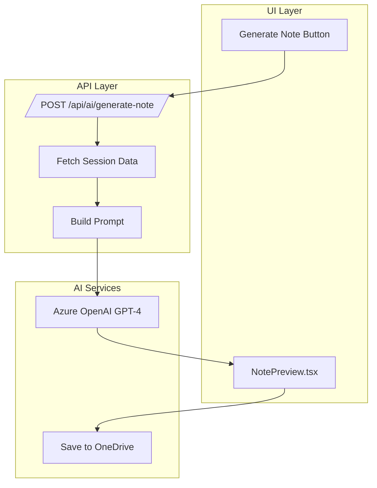

# AI Progress Notes Technical Setup

```mermaid
flowchart TD
  subgraph UI Layer
    Button["Generate Note" Button]
    Modal[NotePreview.tsx]
  end

  subgraph API Layer
    NoteAPI[/POST /api/ai/generate-note/]
    SessionFetcher[Fetch Session Data]
    PromptBuilder[Build Prompt]
  end

  subgraph AI Services
    OpenAI[Azure OpenAI GPT-4]
    OneDrive[Save to OneDrive]
  end

  Button --> NoteAPI
  NoteAPI --> SessionFetcher
  SessionFetcher --> PromptBuilder
  PromptBuilder --> OpenAI
  OpenAI --> Modal
  Modal --> OneDrive
```
