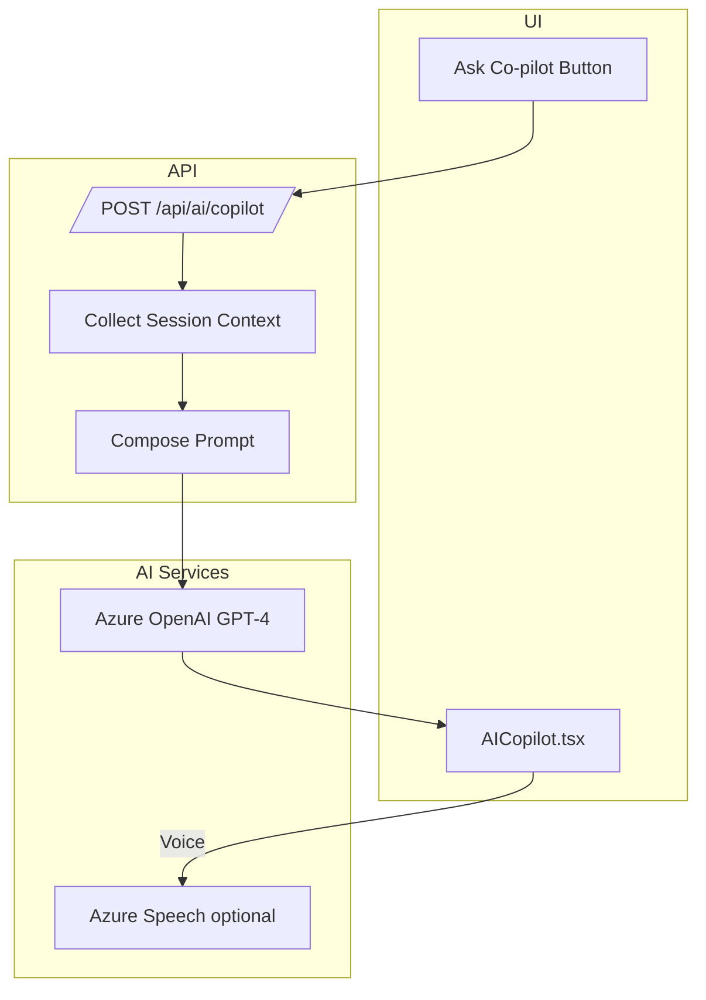

# AI Co-pilot Technical Setup

```mermaid
flowchart TD
  subgraph UI
    CopilotButton["Ask Co-pilot" Button]
    CopilotPanel[AICopilot.tsx]
  end

  subgraph API
    CopilotAPI[/POST /api/ai/copilot/]
    ContextCollector[Collect Session Context]
    PromptComposer[Compose Prompt]
  end

  subgraph AI Services
    GPT4[Azure OpenAI GPT-4]
    Speech[Azure Speech optional]
  end

  CopilotButton --> CopilotAPI
  CopilotAPI --> ContextCollector --> PromptComposer --> GPT4
  GPT4 --> CopilotPanel
  CopilotPanel -->|Voice| Speech
```
