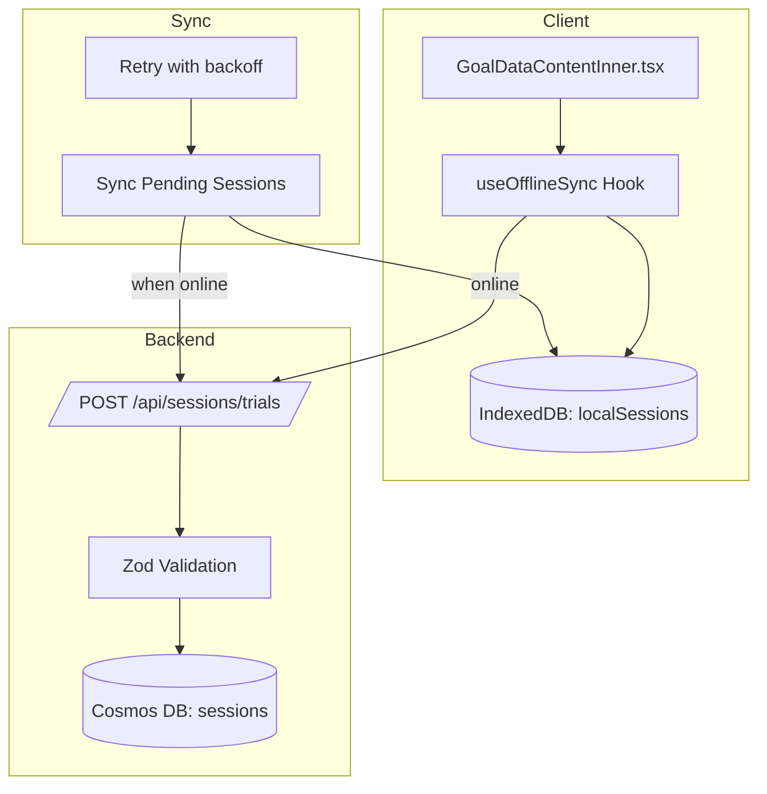

# Data Collection Technical Setup

```mermaid
flowchart TD
  subgraph Client
    UI[GoalDataContentInner.tsx]
    Offline[useOfflineSync Hook]
    IndexedDB[(IndexedDB: localSessions)]
  end

  subgraph Backend
    API[/POST /api/sessions/trials/]
    Validator[Zod Validation]
    Cosmos[(Cosmos DB: sessions)]
  end

  subgraph Sync
    SyncWorker[Sync Pending Sessions]
    Retry[Retry with backoff]
  end

  UI --> Offline
  Offline --> IndexedDB
  Offline -->|online| API
  API --> Validator --> Cosmos
  SyncWorker --> IndexedDB
  SyncWorker -->|when online| API
  Retry --> SyncWorker
```
