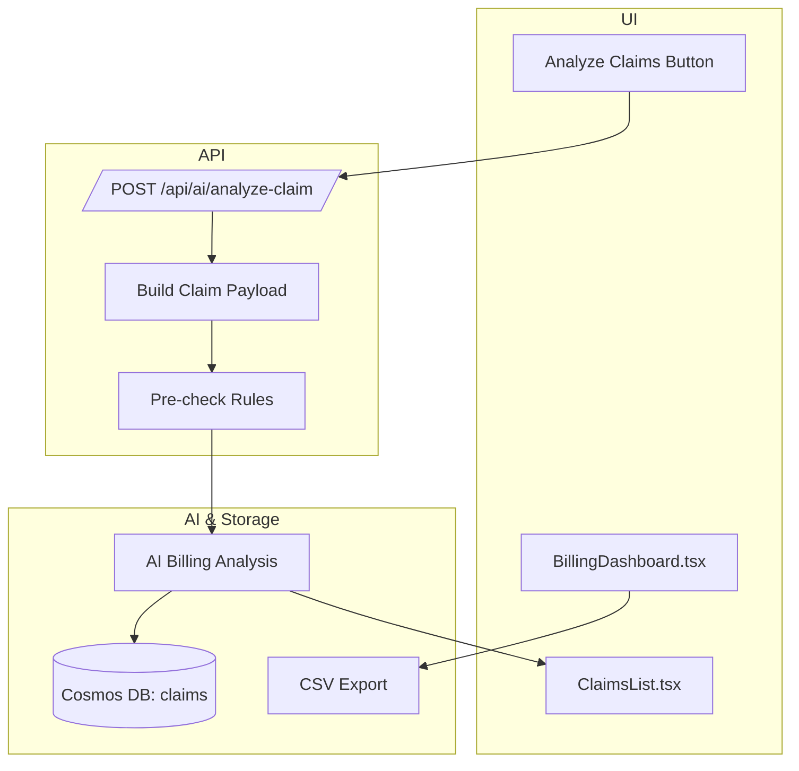

# Smart Billing Technical Setup

```mermaid
flowchart TD
  subgraph UI
    BillingDashboard[BillingDashboard.tsx]
    ClaimsTable[ClaimsList.tsx]
    AnalyzeButton["Analyze Claims" Button]
  end

  subgraph API
    BillingAPI[/POST /api/ai/analyze-claim/]
    ClaimBuilder[Build Claim Payload]
    Validation[Pre-check Rules]
  end

  subgraph AI & Storage
    BillingAI[AI Billing Analysis]
    CosmosClaims[(Cosmos DB: claims)]
    ExportCSV[CSV Export]
  end

  AnalyzeButton --> BillingAPI
  BillingAPI --> ClaimBuilder --> Validation
  Validation --> BillingAI --> ClaimsTable
  BillingAI --> CosmosClaims
  BillingDashboard --> ExportCSV
```
