# Wabi Care Technical Architecture - Mermaid Diagrams

## 1. High-Level System Architecture

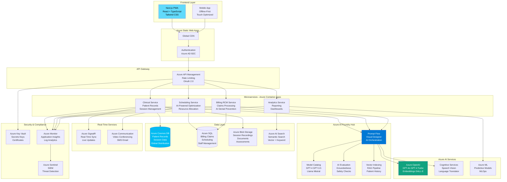

---

## 2. Azure AI Foundry Core Components

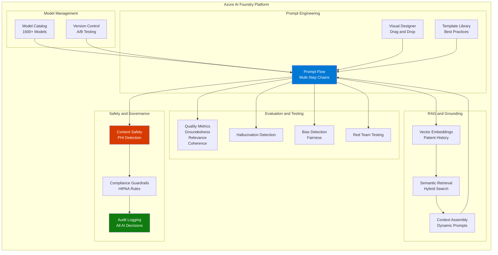

---

## 3. Feature Architecture Map

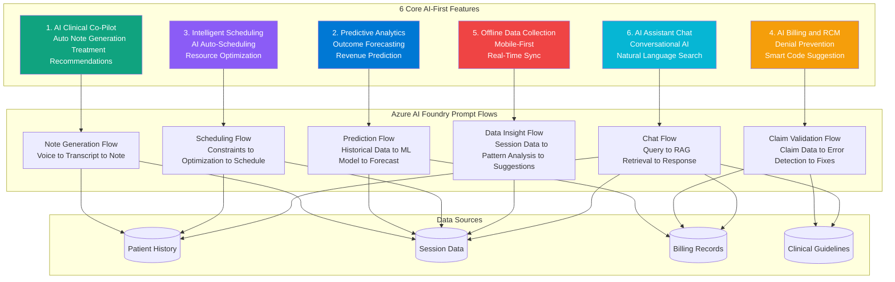

---

## 4. AI Clinical Co-Pilot Flow (Feature #1)

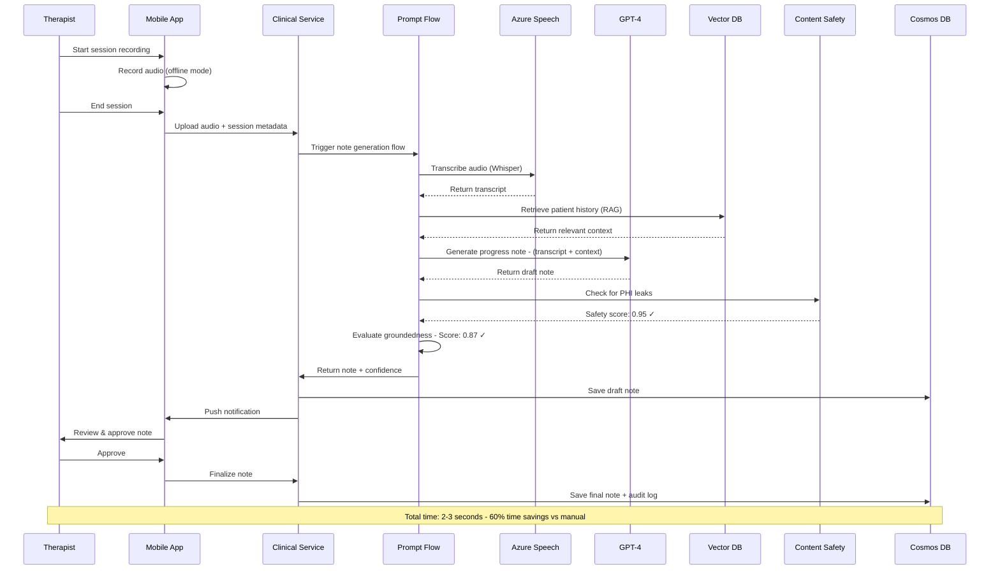

---

## 5. Predictive Analytics Flow (Feature #2)

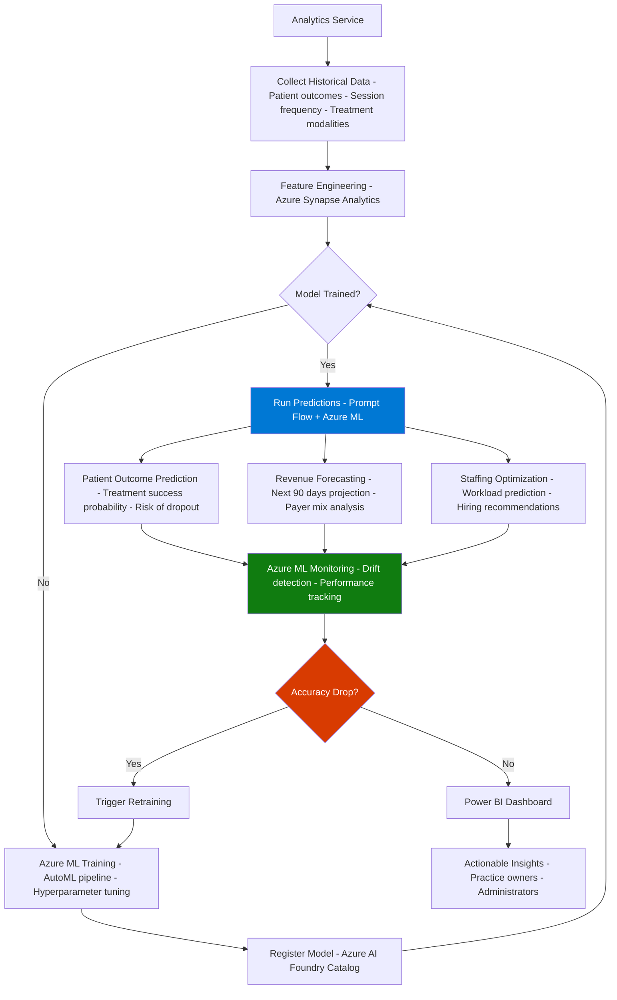

---

## 6. Intelligent Scheduling Flow (Feature #3)

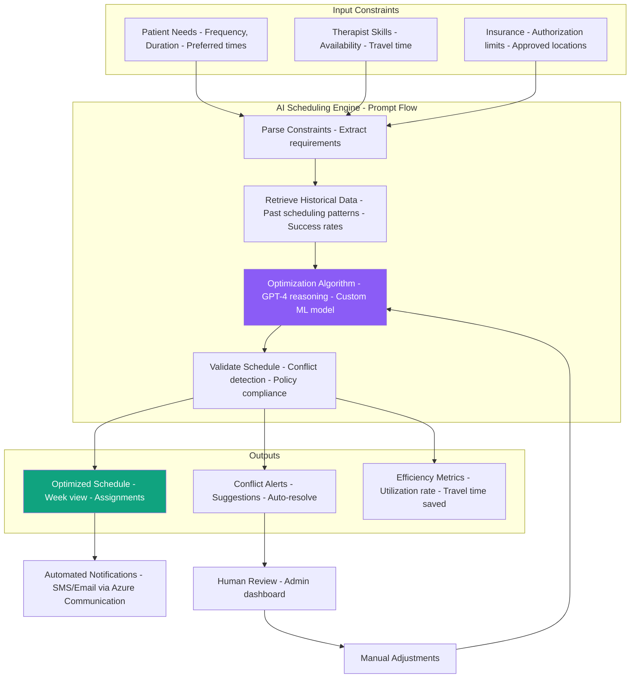

---

## 7. AI Billing & RCM with Denial Prevention (Feature #4)

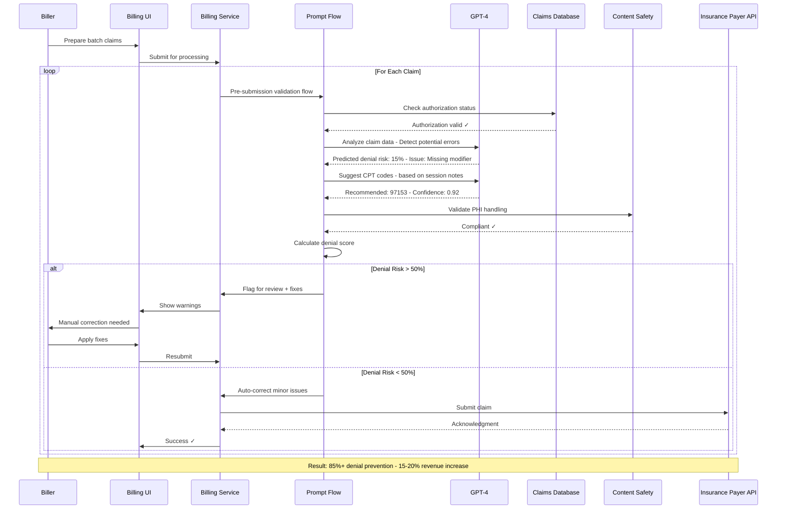

---

## 8. Offline-First Data Collection Flow (Feature #5)

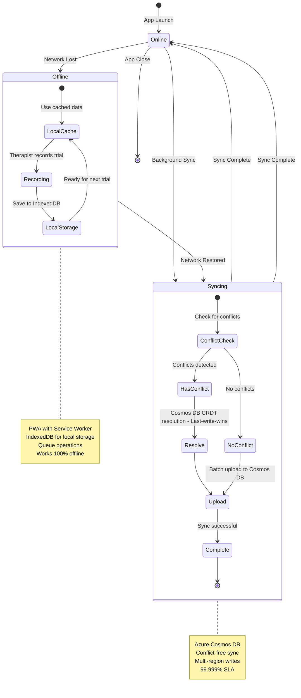

---

## 9. AI Assistant Chat Flow (Feature #6)

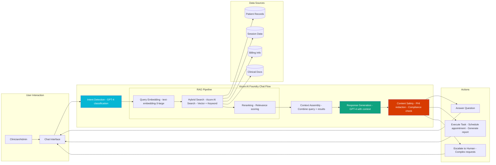

---

## 10. Data Architecture & Flow

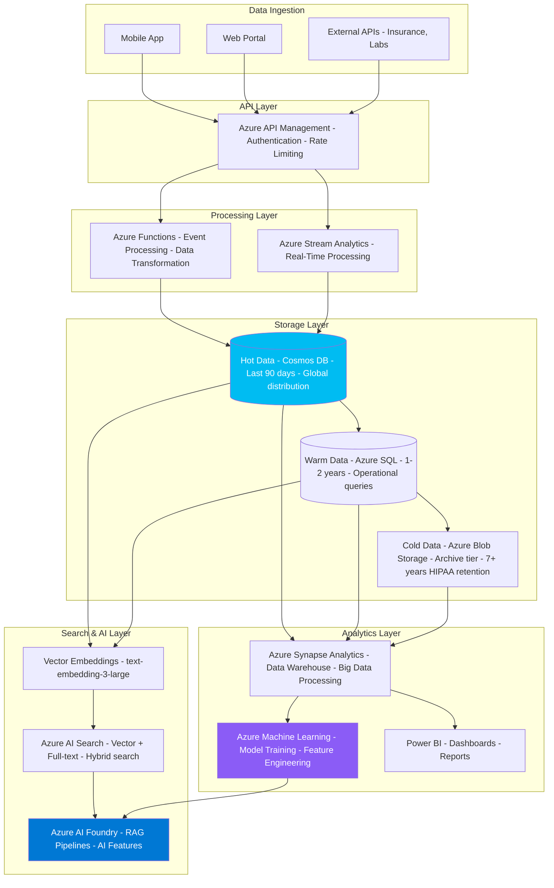

---

## 11. Security & Compliance Architecture

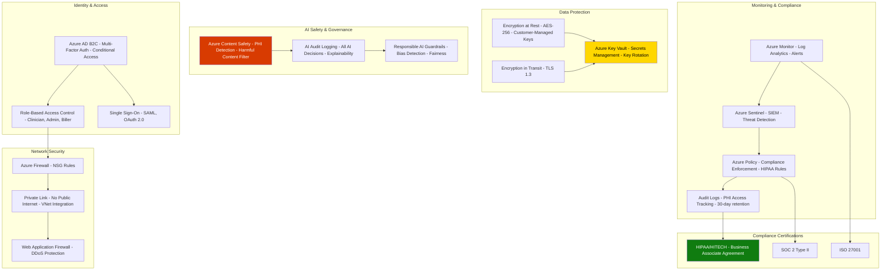

---

## 12. Deployment & DevOps Pipeline

```mermaid
graph LR
    subgraph "Development"
        Dev[Developer - Local Environment]
        Git[GitHub - Source Control - Pull Requests]
    end

    subgraph "CI Pipeline - GitHub Actions"
        Build[Build - npm install - TypeScript compile]
        Test[Automated Tests - Unit, Integration - E2E with Playwright]
        Scan[Security Scan - Snyk, SonarQube - Dependency Check]
        Quality[Quality Gates - Code Coverage > 80% - No Critical Issues]
    end

    subgraph "Azure DevOps / GitHub Actions"
        IaC[Infrastructure as Code - Azure Bicep - Terraform]
        Provision[Provision Resources - Azure Container Apps - Databases, AI Services]
    end

    subgraph "CD Pipeline"
        DevDeploy[Deploy to Dev - Azure Container Apps]
        DevTest[Smoke Tests - Health Checks]
        
        StageDeploy["Deploy to Staging
        Blue-Green Deployment"]
        StageTest["Integration Tests
        AI Evaluation Tests"]
        
        ProdApproval{Manual Approval}
        ProdDeploy["Deploy to Production
        Canary Deployment
        5% to 100%"]
        ProdTest["Production Monitoring
        Application Insights"]
    end

    subgraph "Monitoring"
        Metrics[Metrics Collection - Latency, Errors - AI Accuracy]
        Alerts[Alerts & Notifications - PagerDuty, Teams]
        Rollback[Automated Rollback - If error rate > 5%]
    end

    Dev --> Git
    Git --> Build
    Build --> Test
    Test --> Scan
    Scan --> Quality
    
    Quality --> IaC
    IaC --> Provision
    Provision --> DevDeploy
    
    DevDeploy --> DevTest
    DevTest --> StageDeploy
    StageDeploy --> StageTest
    StageTest --> ProdApproval
    
    ProdApproval -->|Approved| ProdDeploy
    ProdApproval -->|Rejected| Git
    
    ProdDeploy --> ProdTest
    ProdTest --> Metrics
    Metrics --> Alerts
    Alerts --> Rollback
    Rollback --> StageDeploy

    style Quality fill:#107c10,color:#fff
    style ProdApproval fill:#ffd700,color:#000
    style Rollback fill:#d83b01,color:#fff
```

---

## 13. User Journey - Therapist Daily Workflow

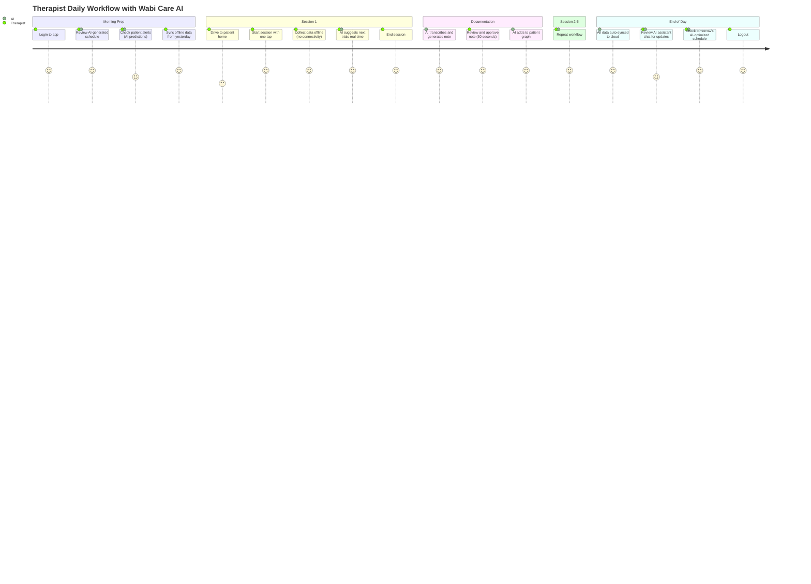

---

## 14. Cost Optimization Strategy

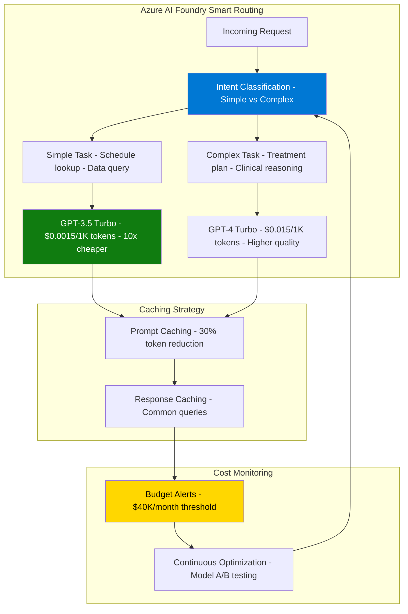

---

## 15. Phased Implementation Roadmap

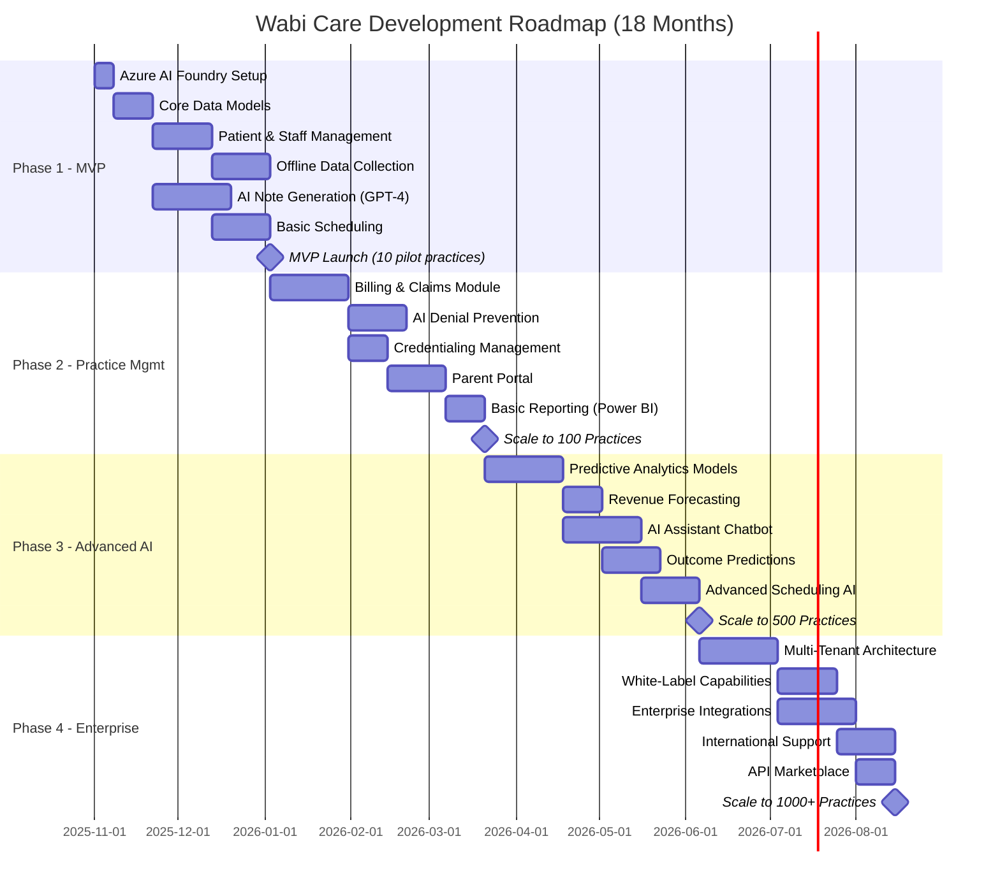

---

## Document Information

**File**: `design_mermaid.md`  
**Location**: `/docs/design/`  
**Version**: 1.0  
**Last Updated**: October 15, 2025  
**Purpose**: Visual technical architecture diagrams for Wabi Care AI-first ABA practice management platform

**Related Documents**:
- `architecture.md` - Detailed technical architecture document
- `../README.md` - Project overview
- `../SOFT_UI_DESIGN_RULES.md` - UI/UX design guidelines

