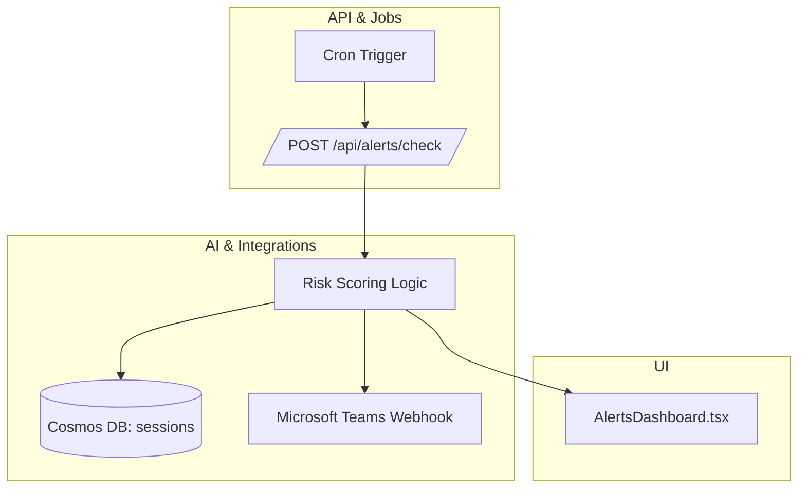

# Risk Alerts Technical Setup

```mermaid
flowchart TD
  subgraph UI
    AlertsWidget[AlertsDashboard.tsx]
  end

  subgraph API & Jobs
    AlertAPI[/POST /api/alerts/check/]
    CronJob[Cron Trigger]
  end

  subgraph AI & Integrations
    RiskModel[Risk Scoring Logic]
    CosmosSessions[(Cosmos DB: sessions)]
    TeamsWebhook[Microsoft Teams Webhook]
  end

  CronJob --> AlertAPI
  AlertAPI --> RiskModel
  RiskModel --> CosmosSessions
  RiskModel --> AlertsWidget
  RiskModel --> TeamsWebhook
```
