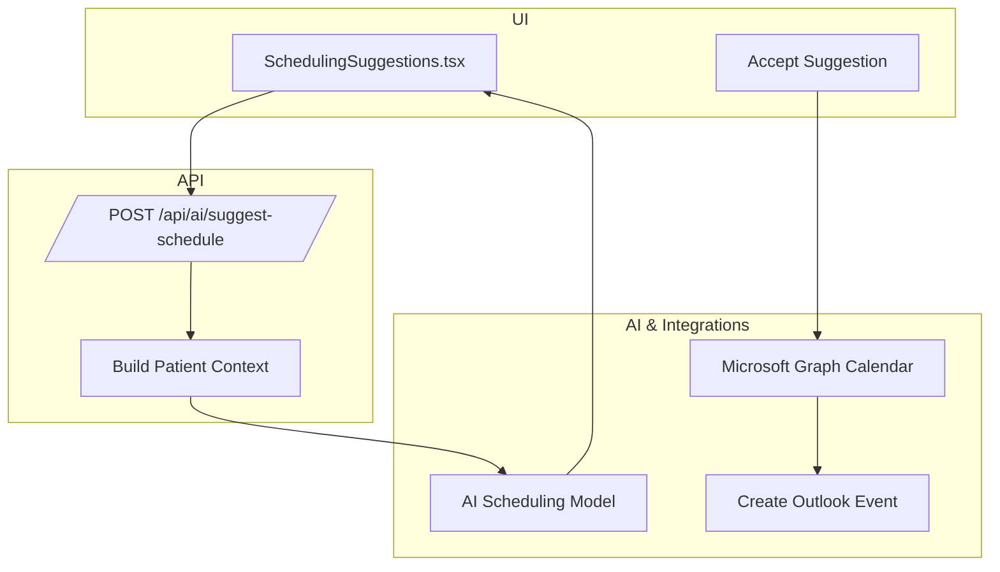

# Predictive Scheduling Technical Setup

```mermaid
flowchart TD
  subgraph UI
    ScheduleWidget[SchedulingSuggestions.tsx]
    AcceptButton["Accept Suggestion"]
  end

  subgraph API
    ScheduleAPI[/POST /api/ai/suggest-schedule/]
    ContextBuilder[Build Patient Context]
  end

  subgraph AI & Integrations
    SchedulingAI[AI Scheduling Model]
    GraphAPI[Microsoft Graph Calendar]
    OutlookEvent[Create Outlook Event]
  end

  ScheduleWidget --> ScheduleAPI
  ScheduleAPI --> ContextBuilder --> SchedulingAI
  SchedulingAI --> ScheduleWidget
  AcceptButton --> GraphAPI --> OutlookEvent
```
