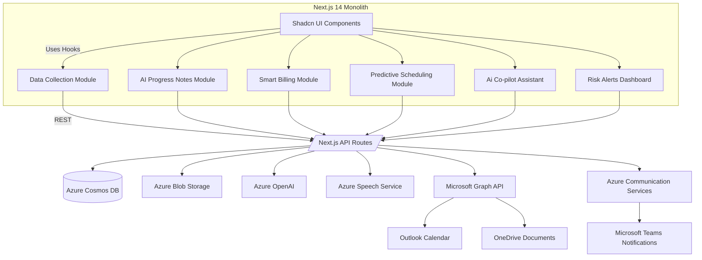

# MVP Technical Architecture Diagram

```mermaid
graph TD
  subgraph Client[Next.js 14 Monolith]
    UI[Shadcn UI Components]
    DataCollection[Data Collection Module]
    AINotes[AI Progress Notes Module]
    Billing[Smart Billing Module]
    Scheduling[Predictive Scheduling Module]
    Copilot[Ai Co-pilot Assistant]
    RiskAlerts[Risk Alerts Dashboard]
  end

  UI -->|Uses Hooks| DataCollection
  UI --> AINotes
  UI --> Billing
  UI --> Scheduling
  UI --> Copilot
  UI --> RiskAlerts

  DataCollection -->|REST| API[/Next.js API Routes/]
  AINotes --> API
  Billing --> API
  Scheduling --> API
  Copilot --> API
  RiskAlerts --> API

  API --> Cosmos[(Azure Cosmos DB)]
  API --> Blob[Azure Blob Storage]
  API --> OpenAI[Azure OpenAI]
  API --> Speech[Azure Speech Service]
  API --> Graph[Microsoft Graph API]
  API --> Teams[Azure Communication Services]

  Graph --> Outlook[Outlook Calendar]
  Graph --> OneDrive[OneDrive Documents]
  Teams --> MSTeams[Microsoft Teams Notifications]
```